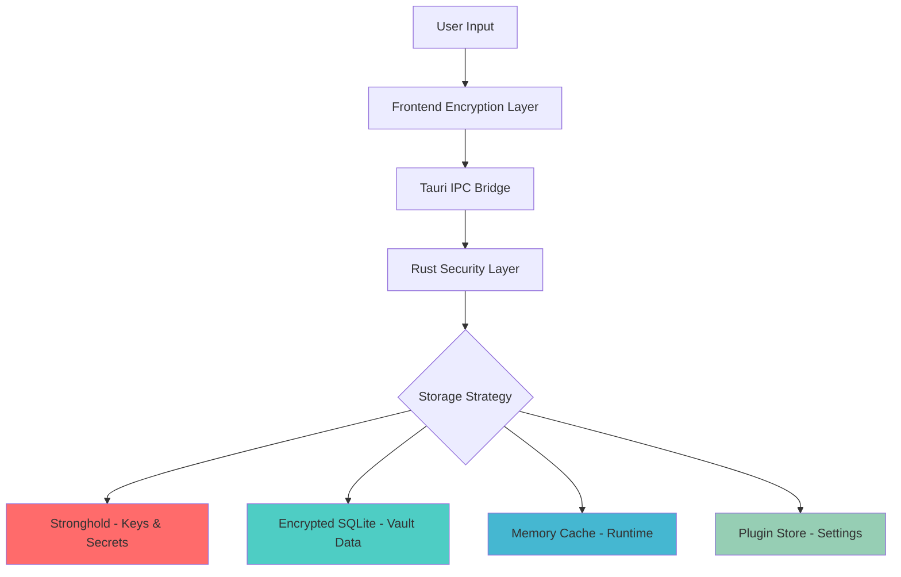

# Chiikawarden - Modern Password Manager Desktop Application

<div align="center">


**A modern, secure, and performant password manager desktop application built with Tauri + React**

[](LICENSE)
[](https://github.com/chiikawarden/chiikawarden/actions)
[](https://github.com/chiikawarden/chiikawarden/releases)
[](https://github.com/chiikawarden/chiikawarden/releases)

[**Download**](https://github.com/chiikawarden/chiikawarden/releases) • [**Documentation**](./docs/) • [**Contributing**](#contributing) • [**Security**](#security)

</div>

## ✨ Features

### 🔐 **Military-Grade Security**
- **Zero-knowledge architecture** - Your data never leaves your device unencrypted
- **AES-256-GCM encryption** with hardware acceleration when available
- **Argon2id key derivation** - Memory-hard protection against brute force
- **Stronghold secure storage** - Military-grade key protection by IOTA
- **Biometric authentication** - Touch ID, Windows Hello, and Linux PAM support

### 🚀 **Modern Technology Stack**
- **Frontend**: React 19+ with modern hooks and concurrent features
- **Backend**: Rust with Tauri 2.0+ for native performance
- **Routing**: TanStack Router with type-safe file-based routing
- **State Management**: TanStack Query + Zustand stores
- **UI Framework**: TailwindCSS 4+ + HeroUI for modern design
- **Storage**: Hybrid architecture (Stronghold + Encrypted SQLite + Memory Cache)

### 📱 **Cross-Platform Compatibility**
- **Windows** (x64, ARM64) with Windows Hello integration
- **macOS** (Intel, Apple Silicon) with Touch ID support
- **Linux** (AppImage, deb, rpm) with PAM authentication
- **Single codebase** for all platforms with native integrations

### 🔄 **Bitwarden API Compatible**
- **Full compatibility** with Bitwarden servers and self-hosted instances
- **Seamless migration** from official Bitwarden clients
- **Real-time synchronization** across all your devices
- **Offline-first design** with intelligent conflict resolution

## 🛠️ Technology Stack

| Component | Technology | Purpose |
|-----------|------------|---------|
| **Frontend** | React 19+ + TypeScript 5.8+ | Modern UI with concurrent features |
| **Backend** | Tauri 2.0+ + Rust 2021 | Native performance with security |
| **Routing** | TanStack Router 1.12+ | Type-safe file-based routing |
| **State** | TanStack Query 5.8+ + Zustand | Server state + local state management |
| **Storage** | Stronghold + SQLite + Memory Cache | Multi-layer security architecture |
| **Crypto** | Ring + AES-GCM + Argon2 + RSA | Hardware-accelerated encryption |
| **UI** | TailwindCSS 4+ + HeroUI | Modern utility-first styling |
| **i18n** | Lingui | Type-safe internationalization |

## 🚀 Quick Start

### Prerequisites

- **Node.js** 18+ and **Bun** 1.0+
- **Rust** 1.70+ with Cargo
- **Platform-specific dependencies**:
  - **Windows**: Visual Studio Build Tools or Visual Studio Community
  - **macOS**: Xcode Command Line Tools
  - **Linux**: `build-essential`, `libwebkit2gtk-4.0-dev`, `libssl-dev`

### Installation

```bash
# Clone the repository
git clone https://github.com/chiikawarden/chiikawarden.git
cd chiikawarden

# Install dependencies
bun install

# Install Rust dependencies
cd src-tauri && cargo fetch && cd ..

# Start development server
bun run tauri:dev
```

### Available Scripts

```bash
# Development
bun run dev              # Start frontend dev server
bun run tauri:dev        # Start Tauri development mode
bun run tauri:build      # Build for production

# Testing
bun run test             # Run unit tests
bun run test:ui          # Run tests with UI
bun run test:e2e         # Run end-to-end tests

# Quality & Linting
bun run lint             # Check code quality
bun run lint:fix         # Fix linting issues
bun run type-check       # TypeScript type checking

# Database
bun run db:migrate       # Run database migrations
bun run db:reset         # Reset database
```

## 📁 Project Structure & Routing

Chiikawarden uses a file-based routing system powered by TanStack Router. The project is organized to clearly separate frontend (SolidJS) and backend (Rust) concerns, with a routing structure that mirrors the URL layout.

> **📚 [View the Complete Project Structure and Routing Guide](./docs/development-guide/00-project-structure-and-routing.md)**
>
> For a detailed breakdown of the file system, component architecture, and routing patterns.

## 🔒 Security Architecture

### Multi-Layer Security Design



### Security Features

- ✅ **Zero-knowledge architecture** - No plaintext data on disk
- ✅ **Client-side encryption only** - Server never sees unencrypted data
- ✅ **Stronghold secure storage** - Military-grade key protection
- ✅ **Argon2id key derivation** - Memory-hard password hashing
- ✅ **Perfect forward secrecy** - Session keys rotated regularly
- ✅ **Secure memory management** - Automatic secret zeroization
- ✅ **Hardware security module support** - When available

## 🎯 Development Roadmap

### Phase 1: Foundation ✅
- [x] Project setup with modern tooling
- [x] TanStack Router implementation
- [x] Hybrid storage architecture
- [x] Core cryptographic services
- [x] Database schema and migrations

### Phase 2: Authentication 🚧
- [x] Master key derivation
- [x] Login/logout functionality
- [ ] Two-factor authentication
- [ ] Biometric authentication
- [ ] Session management

### Phase 3: Vault Management 📋
- [ ] Cipher CRUD operations
- [ ] Folder management
- [ ] Advanced search functionality
- [ ] Import/export capabilities
- [ ] Password generation

### Phase 4: Synchronization 🔄
- [ ] Bitwarden API integration
- [ ] Real-time sync with conflict resolution
- [ ] Offline mode support
- [ ] Background synchronization

### Phase 5: User Experience 🎨
- [ ] Modern responsive UI
- [ ] Dark/light theme support
- [ ] Keyboard shortcuts
- [ ] Accessibility compliance (WCAG 2.1)

### Phase 6: System Integration 🔗
- [ ] Browser auto-fill integration
- [ ] System tray functionality
- [ ] Global hotkeys
- [ ] Auto-start capabilities

### Phase 7: Advanced Features ⚡
- [ ] Password audit and breach monitoring
- [ ] Secure file attachments
- [ ] Emergency access
- [ ] Organization management

## 📊 Performance Targets

| Metric | Target | Current |
|--------|--------|---------|
| **Startup Time** | < 2 seconds | TBD |
| **Search Results** | < 100ms | TBD |
| **Sync Completion** | < 5 seconds | TBD |
| **Memory Usage** | < 200MB | TBD |
| **CPU Usage (Idle)** | < 5% | TBD |

## 🧪 Testing Strategy

### Test Coverage Goals
- **Unit Tests**: 90%+ coverage for critical paths
- **Integration Tests**: All API endpoints and database operations
- **E2E Tests**: Complete user workflows
- **Security Tests**: Cryptographic operations and key management
- **Performance Tests**: Load testing and memory profiling

### Testing Technologies
- **Unit Testing**: Vitest + React Testing Library + Storybook
- **E2E Testing**: Playwright with Tauri
- **Security Testing**: Custom Rust security test suite
- **Performance**: Criterion.rs for Rust benchmarks

## 🌍 Internationalization

Supported languages:
- 🇺🇸 English (en) - Default
- 🇨🇳 Chinese Simplified (zh-CN)
- 🇭🇰 Chinese Traditional Hong Kong (zh-HK)
- 🇹🇼 Chinese Traditional Taiwan (zh-TW)

Add more languages by contributing to the `messages/` directory!

## 🤝 Contributing

We welcome contributions! Please read our [Contributing Guidelines](CONTRIBUTING.md) before submitting pull requests.

## 🔧 TypeScript Type Generation

This project uses `tauri-specta` for type-safe communication between the Rust backend and TypeScript frontend.

### Generated Types Location

The generated TypeScript types are located at:
```
src/lib/tauri-commands.ts
```

This file is automatically generated during development builds and should not be edited manually.

### Type Generation Process

When you run the development server, the type generation process:

1. Collects all Rust commands and types with `#[specta::specta]` annotations
2. Exports them to TypeScript using `specta-typescript`
3. Provides type-safe command interfaces for the frontend

### Usage

All Tauri commands are automatically typed and available through the generated bindings:

```typescript
import { commands } from '@/lib/tauri-commands';

// All commands are fully typed
const result = await commands.loginWithPassword(email, password);
```

### Development Setup

1. **Fork** the repository
2. **Clone** your fork: `git clone https://github.com/yourusername/chiikawarden.git`
3. **Install** dependencies: `bun install`
4. **Create** a feature branch: `git checkout -b feature/amazing-feature`
5. **Make** your changes and add tests
6. **Test** your changes: `bun run test`
7. **Commit** with conventional commits: `git commit -m "feat: add amazing feature"`
8. **Push** to your branch: `git push origin feature/amazing-feature`
9. **Submit** a pull request

### Code Standards

- **TypeScript** for frontend with strict type checking
- **Rust** for backend following Rust API guidelines
- **ESLint + Biome** for code quality and formatting
- **Conventional Commits** for consistent commit messages
- **Comprehensive tests** for all new features

## 📄 License

This project is licensed under the **MIT License** - see the [LICENSE](LICENSE) file for details.

## 🔐 Security

### Reporting Security Issues

**Please DO NOT open GitHub issues for security vulnerabilities.**

For security-related issues, please email: **security@chiikawarden.com**

We take security seriously and will respond within 24 hours. Please include:
- Description of the vulnerability
- Steps to reproduce
- Potential impact assessment
- Any suggested fixes

### Security Audits

- Regular security audits by third-party firms
- Automated vulnerability scanning in CI/CD
- Dependency vulnerability monitoring
- Code security analysis with advanced tooling

## 🙏 Acknowledgments

- **Bitwarden** team for the excellent open-source password manager ecosystem
- **Tauri** team for the amazing cross-platform framework
- **React** team for the powerful UI library
- **TanStack** team for the powerful router and query libraries
- **IOTA Foundation** for the Stronghold secure storage solution

## 📞 Support

- **Documentation**: [docs/](./docs/)
- **Issues**: [GitHub Issues](https://github.com/chiikawarden/chiikawarden/issues)
- **Discussions**: [GitHub Discussions](https://github.com/chiikawarden/chiikawarden/discussions)
- **Email**: support@chiikawarden.com

---

<div align="center">

**Made with ❤️ by the Chiikawarden team**

[Website](https://chiikawarden.com) • [Twitter](https://twitter.com/chiikawarden) • [Discord](https://discord.gg/chiikawarden)

</div>
