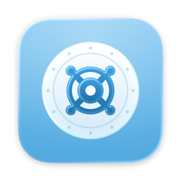
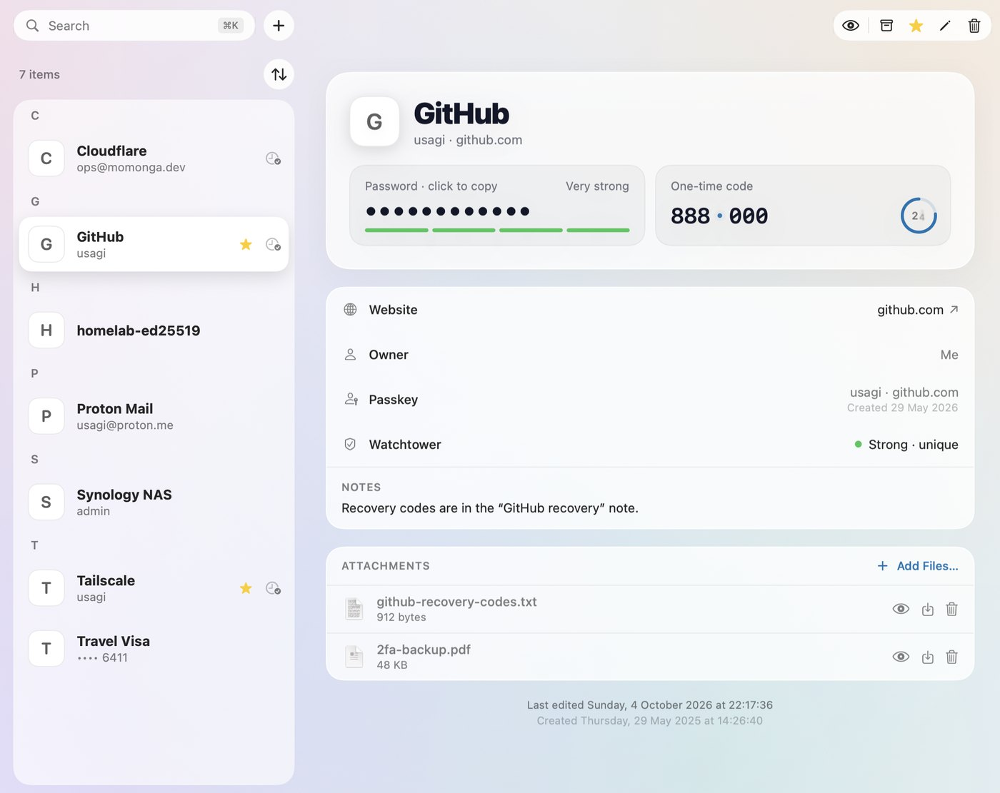
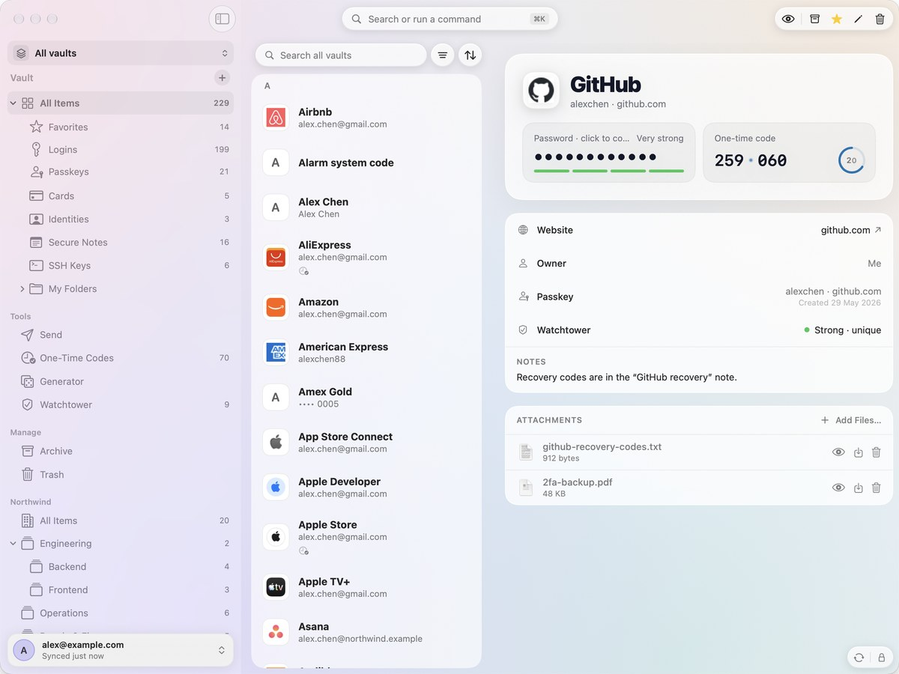
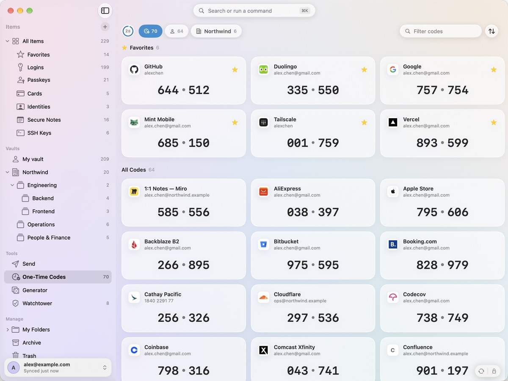
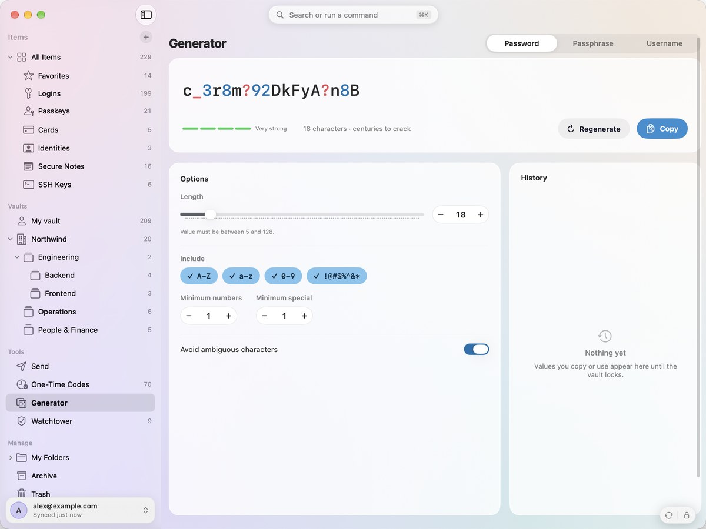
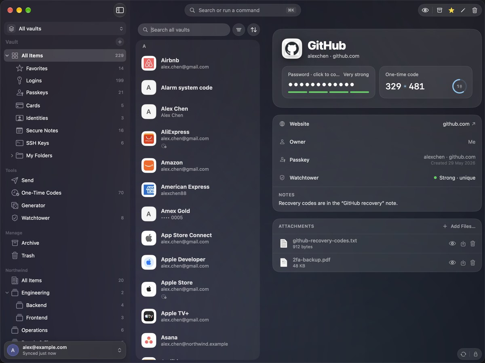
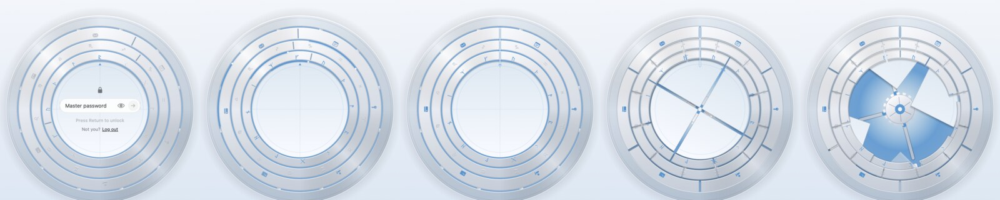
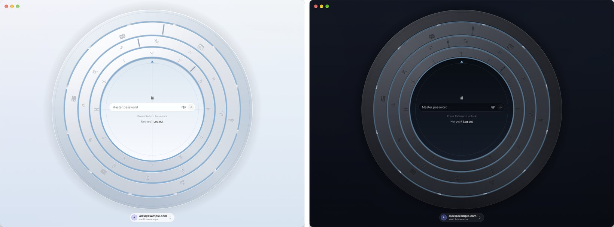

<p align="center">
  
</p>

<h1 align="center">Triwarden</h1>

<p align="center">
  A native Mac password manager for <a href="https://github.com/dani-garcia/vaultwarden">Vaultwarden</a> and Bitwarden.<br>
  Swift and SwiftUI, built for macOS 26.
</p>

<p align="center">
  <a href="https://github.com/sinhong2011/triwarden/actions/workflows/ci.yml"></a>
  <a href="LICENSE"></a>
  
  
  
</p>

<p align="center">
  
</p>

> **Status:** in active development, before the first release. It works with real Vaultwarden and Bitwarden accounts
> and is tested against both, but keep your usual client around until 1.0.

## Features

**Your vault, natively**
- Logins, secure notes, cards, identities and SSH keys, with folders, favorites, custom fields, attachments, Archive
  and Trash; password history, clone, and "ask for master password" on sensitive items.
- Several accounts at once, across servers: self-hosted Vaultwarden or Bitwarden, and Bitwarden cloud (US and EU).
- Organizations and collections: a vault switcher (All vaults, My vault, each organization), move items into an
  organization, change collections, event logs for admins; live sync over WebSocket.
- Pick many items (⌘-click, ⇧-click, ⌘A) to move, archive, trash or restore them at once.
- Works offline from the encrypted cache; edits go straight to the server.

**Fast to reach**
- A command palette from anywhere (⇧⌘Space, or a shortcut you choose; ⌘K in the window) to find any item or run any
  command. Called over a browser, it puts that page's logins first, and ↵ copies the password and takes you back;
  the menu bar panel does the same.
- A menu bar panel with the item you need, one-time codes and the generator.
- Two-finger swipes between sidebar, list and item on narrow windows.

**Deep macOS integration**
- System AutoFill for passwords, **passkeys** and one-time codes, in Safari, Chrome and apps; equivalent domains
  (a google.com login fills on youtube.com).
- Touch ID unlock, one touch for every account.
- An SSH agent backed by your vault's SSH keys (sign git commits too).
- A Safari extension and a Chrome native host; App Intents and Shortcuts; a `tw` command-line tool.

**Security tools**
- Watchtower: weak, reused, breached and unsecured (http://) passwords, and sites that offer two-step login you
  haven't set up (k-anonymity for breaches; nothing leaves in the clear).
- Account security: fingerprint phrase, two-step login (authenticator app, email, recovery code), change the master
  password or KDF, devices, sign out everywhere, and approve sign-ins from your other devices.
- Emergency access: trusted contacts who can view or take over your vault after a wait you choose.
- A generator for passwords, passphrases (EFF wordlist) and usernames, with history.
- Send: share text or files with an encrypted link; edit it later and keep the same link.
- Import from Bitwarden, 1Password, LastPass, KeePass, Proton Pass, Dashlane, Apple Passwords, Chrome and Firefox;
  export in Bitwarden's formats, including password-protected JSON.

<table>
  <tr>
    <td></td>
    <td></td>
  </tr>
  <tr>
    <td align="center"><sub>Command palette</sub></td>
    <td align="center"><sub>One-time codes</sub></td>
  </tr>
  <tr>
    <td></td>
    <td></td>
  </tr>
  <tr>
    <td align="center"><sub>Generator</sub></td>
    <td align="center"><sub>Dark mode</sub></td>
  </tr>
</table>

The lock is a vault door over the vault. You type the master password at its hub; each character lights one of the
pins' runes and turns the rings (the tumbler carries the twelve signs of the zodiac). Each of the three rings has a
notch. On unlock they turn, outside in, until the notches line up into one keyway and light runs down it to the hub;
only then does the door take itself apart, and the screen parts like a vault's inner gate:

<p align="center"></p>
<p align="center"></p>

## Install

Signed and notarized releases, with in-app updates and a Homebrew cask, come with the first release. Until then,
build it from source (below).

## Build from source

Requirements: macOS 26 and Xcode 26, plus [XcodeGen](https://github.com/yonaskolb/XcodeGen) (`brew install xcodegen`).

```bash
git clone https://github.com/sinhong2011/triwarden.git
cd triwarden
make run        # generate the project, build and open the app
```

| Command | What it does |
| --- | --- |
| `make` | List all commands |
| `make test` | Unit tests for the crypto, API, import/export and SSH agent (`Packages/VaultCore`) |
| `make selftest` | End-to-end self-test against a local Vaultwarden dev server (`DevServer/`) |
| `make uitest` | Click-through UI tests on a demo vault (quit any running copy first) |
| `make snapshots` | Light and dark renders of every screen into `build/snapshots` (`ONLY=login,send` for just those) |

Core logic lives in the `Packages/VaultCore` Swift package: `TriCrypto` (KDFs, EncString, keys, TOTP,
generators, passkeys), `VaultwardenAPI` (login, 2FA, SSO, sync, edits, attachments, Send, import/export) and
`SSHAgent`. The app is in `App/`, the AutoFill extension in `AutoFill/`, browser extensions in `BrowserExtension/`.

## Command line

Turn on **Settings › Developer › Answer the tw command**, then link the bundled tool:

```bash
sudo ln -sf /Applications/Triwarden.app/Contents/MacOS/tw /usr/local/bin/tw
```

`tw get github | pbcopy`, `tw code github`, `tw list mail`, `tw generate --length 32`, `tw lock`.
Reading from the vault asks for Touch ID in the app.

## Security

Your master password and keys never leave the Mac; the server only ever sees encrypted data. Keys live in the
Keychain (Secure Enclave–backed for Touch ID). See [SECURITY.md](SECURITY.md) for the details, the threat model, and how
to report a vulnerability privately.

## Accessibility and languages

VoiceOver labels, full keyboard control, Increase Contrast and Reduce Motion are supported; see
[ACCESSIBILITY.md](ACCESSIBILITY.md). The app speaks English, 繁體中文 (台灣), 繁體中文 (香港), 简体中文 and 日本語.

## Contributing

Issues and pull requests are welcome. Commits follow [Conventional Commits](https://www.conventionalcommits.org)
(`feat:`, `fix:`, …), which drive the changelog and releases; see [docs/RELEASING.md](docs/RELEASING.md).
The [roadmap](docs/ROADMAP.md) and [open issues](https://github.com/sinhong2011/triwarden/issues) show what's next.

## License

Triwarden is free software under the [GNU General Public License v3.0](LICENSE): you may use, study, share and
change it, and anyone who distributes a modified version must publish its full source under the same license.
Third-party components and their licenses are listed in [THIRD_PARTY_NOTICES.md](THIRD_PARTY_NOTICES.md); the app
shows them in Settings › About › Acknowledgements.

**Name and icon.** The license covers the code, not the name. "Triwarden" and the app icon may not be used for
modified versions or other products without permission: forks must use their own name and icon, and must not
suggest they are the official app.

Triwarden is not affiliated with Bitwarden, Inc. or the Vaultwarden project. Bitwarden is a trademark of
Bitwarden, Inc.
