# Chiikawarden - Application Technical Architecture Document

## Table of Contents
1. [Executive Summary](#executive-summary)
2. [System Overview](#system-overview)
3. [Technology Stack](#technology-stack)
4. [Application Architecture](#application-architecture)
5. [Frontend Architecture (SolidJS)](#frontend-architecture-solidjs)
6. [Backend Architecture (Tauri/Rust)](#backend-architecture-taurirust)
7. [Security Architecture](#security-architecture)
8. [Data Flow & Communication](#data-flow--communication)
9. [State Management](#state-management)
10. [TanStack Query Best Practices & Advanced Features](#tanstack-query-best-practices--advanced-features)
11. [Routing & Navigation](#routing--navigation)
12. [Internationalization (i18n)](#internationalization-i18n)
13. [Build System & Tooling](#build-system--tooling)
14. [Development Patterns](#development-patterns)
15. [Performance Considerations](#performance-considerations)
16. [Security Considerations](#security-considerations)
17. [Deployment Architecture](#deployment-architecture)
18. [Future Architecture Considerations](#future-architecture-considerations)

## Executive Summary

Chiikawarden is a modern desktop password manager built on a secure, high-performance architecture using Tauri (Rust backend) and SolidJS (reactive frontend). The application follows a security-first design approach with end-to-end encryption, zero-knowledge architecture, and cross-platform compatibility.

### Key Architectural Principles
- **Security-First**: All sensitive operations handled in Rust backend
- **Performance**: Native Rust performance with modern web UI
- **Modularity**: Clear separation of concerns between frontend and backend
- **Type Safety**: Full TypeScript/Rust type safety throughout the stack
- **Reactive**: Real-time UI updates with fine-grained reactivity
- **Cross-Platform**: Single codebase for Windows, macOS, and Linux

## System Overview

### High-Level Architecture

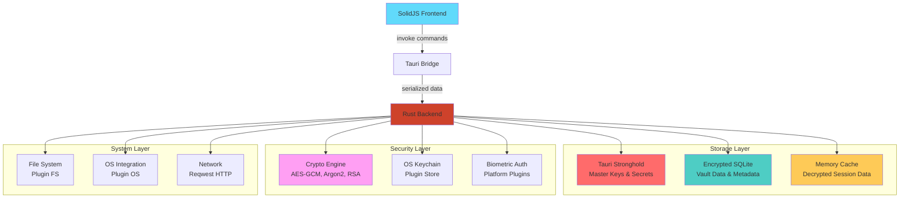

### Core Design Principles

1. **Zero-Knowledge Security**: Server never has access to unencrypted data
2. **Defense in Depth**: Multiple layers of security controls
3. **Principle of Least Privilege**: Minimal permissions and access rights
4. **Fail-Safe Defaults**: Secure by default configurations
5. **Separation of Duties**: Clear boundaries between frontend and backend responsibilities

## Technology Stack

### Frontend Stack
- **Framework**: SolidJS 1.9+ (Reactive UI library)
- **Language**: TypeScript 5.8+ (Type-safe JavaScript)
- **Router**: TanStack Router 1.12+ (Type-safe routing)
- **State Management**: TanStack Query 5.8+ (Advanced server state with offline support) + SolidJS Stores (Local state)
- **Styling**: TailwindCSS 4.1+ + DaisyUI 5.0+ (Utility-first CSS)
- **Build Tool**: Vite 7.0+ (Fast dev server and bundler)
- **i18n**: Paraglide JS 2.1+ (Type-safe internationalization)

### Backend Stack
- **Runtime**: Tauri 2.0+ (Rust-based desktop framework)
- **Language**: Rust 2021 Edition (Systems programming)
- **Serialization**: Serde 1.0+ (JSON serialization)
- **HTTP Client**: Reqwest (HTTP client)
- **Secure Storage**: Tauri Plugin Stronghold (Military-grade key storage)
- **Database**: Tauri Plugin SQL + SQLite (Encrypted database operations)
- **OS Integration**: Tauri Plugin OS + Tauri Plugin Shell (System APIs)
- **File System**: Tauri Plugin FS (Secure file operations)
- **Keychain**: Tauri Plugin Store (Persistent app state)
- **Biometrics**: Platform-specific authentication plugins
- **Cryptography**: 
  - AES-GCM 0.10+ (AEAD encryption)
  - Argon2 0.5+ (Key derivation)
  - RSA 0.9+ (Asymmetric encryption)
  - Ring 0.17+ (Cryptographic primitives)
- **Async Runtime**: Tokio (Async runtime)

### Development Tools
- **Linter**: Biome 2.0+ (Fast linter and formatter)
- **Package Manager**: Bun (Fast package manager)
- **Build Tool**: Tauri CLI + Cargo (Rust build system)
- **Type Checking**: TypeScript + Rust Analyzer

### Required Tauri Plugins
- **tauri-plugin-stronghold**: Secure secret storage and key management
- **tauri-plugin-sql**: Encrypted SQLite database operations
- **tauri-plugin-store**: Persistent application state management
- **tauri-plugin-fs**: Secure file system operations
- **tauri-plugin-os**: Operating system integration
- **tauri-plugin-shell**: System command execution
- **tauri-plugin-window-state**: Window state persistence
- **tauri-plugin-single-instance**: Single application instance
- **tauri-plugin-updater**: Automatic application updates

## Application Architecture

### Layered Architecture

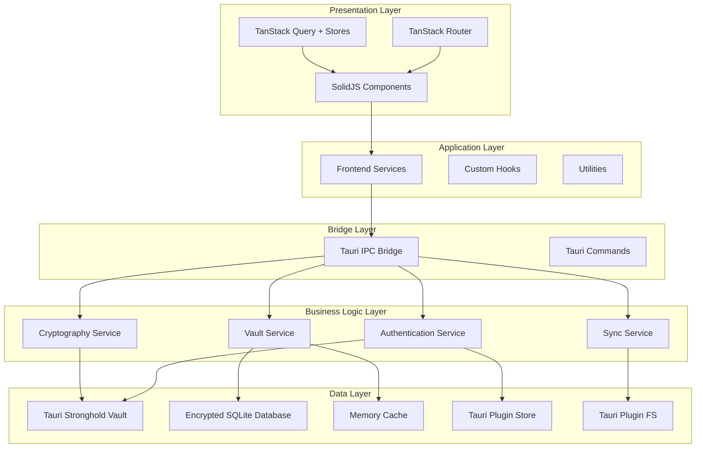

### Separation of Concerns

#### Frontend Responsibilities (SolidJS)
- **UI Rendering**: Component rendering and DOM manipulation
- **User Interaction**: Event handling and form management
- **Client-side Routing**: Navigation and route guards
- **State Management**: Local UI state and server state caching
- **Data Presentation**: Formatting and displaying data
- **Internationalization**: Language switching and message display

#### Backend Responsibilities (Tauri/Rust)
- **Security Operations**: Encryption, decryption, and key management via Stronghold
- **Business Logic**: Core application logic and data validation
- **Data Persistence**: Encrypted SQLite operations via Plugin SQL
- **Secure Storage**: Critical secrets management via Tauri Stronghold
- **System Integration**: OS-specific features via Plugin OS and Shell
- **File Operations**: Secure file access via Plugin FS
- **State Management**: Persistent app state via Plugin Store
- **External API Communication**: Bitwarden server communication via Reqwest
- **Performance-Critical Operations**: Hardware-accelerated crypto operations

## Frontend Architecture (SolidJS)

### Component Architecture

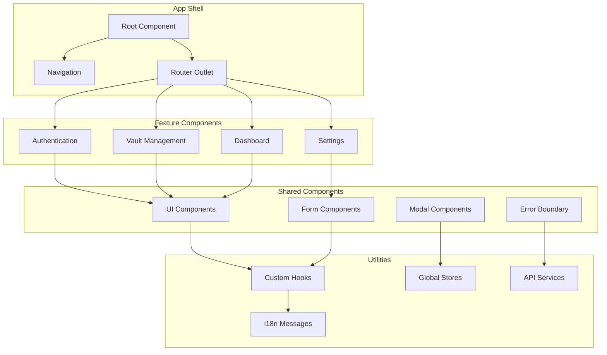

### State Management Strategy

#### Local State (SolidJS Stores)
```typescript
// Authentication State
export const [authState, setAuthState] = createStore<AuthState>({
  isAuthenticated: false,
  userId: null,
  email: null,
  authStatus: 'logged-out'
});

// UI State
export const [uiState, setUiState] = createStore<UIState>({
  sidebarOpen: false,
  theme: 'system',
  currentView: 'vault'
});
```

#### Server State (TanStack Query)
```typescript
// Advanced Vault Data Queries with Offline Support
export function createVaultQueries() {
  const ciphersQuery = createQuery(() => ({
    queryKey: ['ciphers'],
    queryFn: () => invoke('get_all_ciphers'),
    staleTime: 1000 * 60 * 5, // 5 minutes
    gcTime: 1000 * 60 * 30, // 30 minutes cache
    refetchOnWindowFocus: true, // Background sync
    refetchOnReconnect: true, // Sync on network reconnect
    retry: (failureCount, error) => {
      // Retry logic for network failures
      if (failureCount < 3 && error.message.includes('network')) {
        return true;
      }
      return false;
    },
    networkMode: 'offlineFirst', // Offline-first strategy
  }));

  return { ciphersQuery };
}
```

### Reactive Data Flow

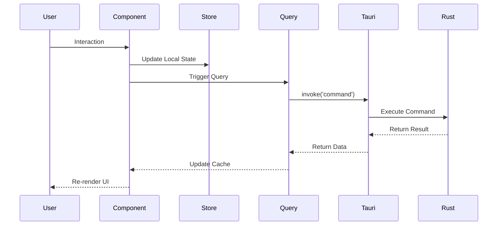

## Backend Architecture (Tauri/Rust)

### Hybrid Storage Architecture

Based on the Tauri vault storage guide recommendations, Chiikawarden implements a **hybrid storage architecture** that combines multiple storage mechanisms for optimal security and performance:

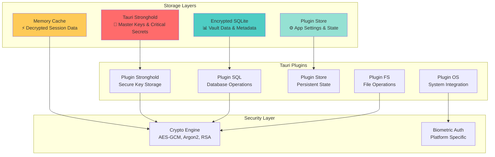

#### Storage Layer Responsibilities

1. **Tauri Stronghold**: Military-grade storage for critical secrets
   - Master keys and user keys
   - Device keys and API tokens
   - Biometric authentication keys
   - Zero-knowledge key derivation

2. **Encrypted SQLite**: High-performance encrypted database
   - Cipher data and metadata
   - Search indices and relationships
   - Sync state and timestamps
   - User preferences and folders

3. **Memory Cache**: Runtime performance optimization
   - Decrypted cipher views during active sessions
   - Frequently accessed data
   - Search results and filtering
   - Automatic cleanup on vault lock

4. **Plugin Store**: Persistent application state
   - Non-sensitive app settings
   - UI preferences and themes
   - Window state and layout
   - User interface customizations

### Service Architecture

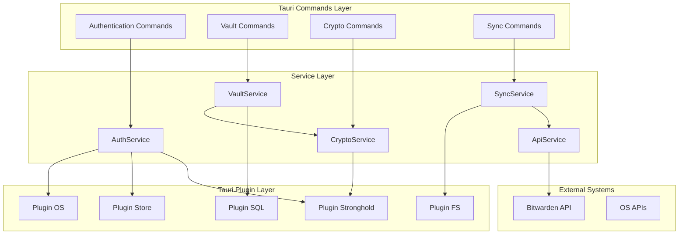

### Core Services

#### Authentication Service
```rust
use tauri_plugin_stronghold::StrongholdStore;
use tauri_plugin_store::StoreBuilder;

pub struct AuthService {
    stronghold: Arc<StrongholdStore>,
    crypto: Arc<CryptoService>,
    app_store: Arc<StoreBuilder>,
}

impl AuthService {
    pub async fn login(&self, email: String, password: String) -> Result<AuthResponse>;
    pub async fn logout(&self, user_id: String) -> Result<()>;
    pub async fn refresh_token(&self) -> Result<String>;
    pub async fn validate_session(&self) -> Result<bool>;
    pub async fn store_master_key(&self, user_id: &str, key: &[u8]) -> Result<()>;
    pub async fn get_master_key(&self, user_id: &str) -> Result<Vec<u8>>;
}
```

#### Cryptography Service
```rust
use aes_gcm::{Aes256Gcm, Key, Nonce};
use argon2::{Argon2, PasswordHash, PasswordHasher};
use ring::rand::{SystemRandom, SecureRandom};

pub struct CryptoService {
    key_cache: Arc<RwLock<HashMap<String, SymmetricKey>>>,
    stronghold: Arc<StrongholdStore>,
    rng: SystemRandom,
}

impl CryptoService {
    pub async fn encrypt_aes_gcm(&self, plaintext: &str, key: &SymmetricKey) -> Result<EncString>;
    pub async fn decrypt_aes_gcm(&self, ciphertext: &EncString, key: &SymmetricKey) -> Result<String>;
    pub async fn derive_argon2_key(&self, password: &str, salt: &[u8], config: ArgonConfig) -> Result<MasterKey>;
    pub async fn generate_secure_key(&self, length: usize) -> Result<SymmetricKey>;
    pub async fn secure_random_bytes(&self, count: usize) -> Result<Vec<u8>>;
}
```

#### Vault Service
```rust
use tauri_plugin_sql::{Migration, MigrationKind};

pub struct VaultService {
    sql_pool: Arc<SqlitePool>,
    crypto: Arc<CryptoService>,
    sync: Arc<SyncService>,
    memory_cache: Arc<RwLock<HashMap<String, CipherView>>>,
}

impl VaultService {
    pub async fn get_all_ciphers(&self, user_id: &str) -> Result<Vec<CipherView>>;
    pub async fn save_cipher(&self, cipher: CipherView) -> Result<()>;
    pub async fn delete_cipher(&self, cipher_id: &str) -> Result<()>;
    pub async fn search_ciphers(&self, query: &str) -> Result<Vec<CipherView>>;
    pub async fn cache_cipher(&self, cipher: CipherView) -> Result<()>;
    pub async fn clear_cache(&self) -> Result<()>;
    pub async fn get_cached_cipher(&self, cipher_id: &str) -> Option<CipherView>;
}
```

## Security Architecture

### Hybrid Storage Security Model

The hybrid storage architecture provides multiple layers of security through strategic data separation:

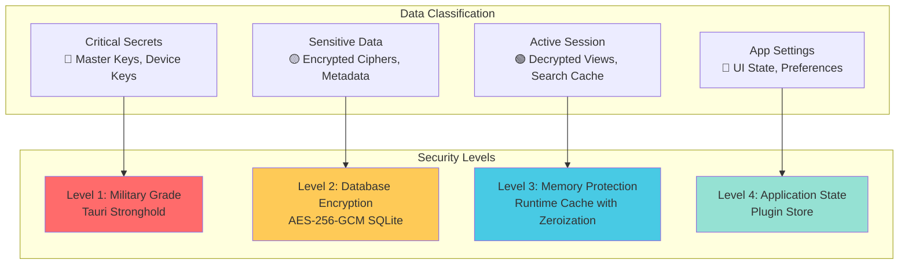

#### Security Benefits

1. **Defense in Depth**: Multiple encryption layers prevent single points of failure
2. **Key Isolation**: Critical keys isolated in hardware-backed Stronghold storage
3. **Memory Safety**: Rust's memory safety prevents buffer overflows and use-after-free
4. **Secure Zeroization**: Automatic cleanup of sensitive data from memory
5. **Platform Integration**: OS-level security features via Tauri plugins

### Encryption Hierarchy

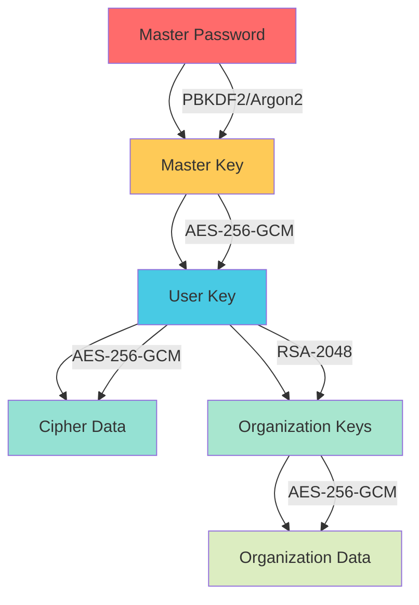

### Key Management

#### Key Derivation Flow
```rust
// Master Key Derivation
pub async fn derive_master_key(
    password: &str,
    email: &str,
    kdf_config: &KdfConfig,
) -> Result<MasterKey> {
    match kdf_config.kdf_type {
        KdfType::Pbkdf2 => {
            pbkdf2_derive(password, email.as_bytes(), kdf_config.iterations)
        }
        KdfType::Argon2id => {
            argon2_derive(password, email.as_bytes(), kdf_config)
        }
    }
}
```

#### Encryption Types
1. **AES-256-CBC with HMAC-SHA256 (Type 2)** - Current standard
2. **AES-256-GCM (Type 6)** - AEAD cipher
3. **XChaCha20-Poly1305 (Type 7)** - Modern AEAD cipher
4. **RSA-2048-OAEP (Type 3/4)** - Asymmetric encryption

### Security Controls

#### Authentication Controls
- **Multi-Factor Authentication**: TOTP, Email, YubiKey, WebAuthn
- **Biometric Authentication**: Platform-specific (Touch ID, Windows Hello, etc.)
- **Device Trust**: Device registration and verification
- **Session Management**: Secure token handling and automatic expiration

#### Data Protection Controls
- **Encryption at Rest**: AES-256-GCM encrypted SQLite via Plugin SQL
- **Encryption in Transit**: TLS 1.3 for all external communications via Reqwest
- **Key Protection**: Military-grade Stronghold storage for critical secrets
- **Memory Protection**: Rust's memory safety with automatic zeroization
- **File Security**: Secure file operations via Plugin FS with proper permissions
- **System Integration**: Platform-specific security via Plugin OS

## Data Flow & Communication

### Frontend to Backend Communication

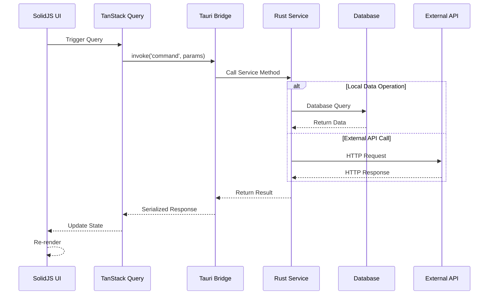

### IPC (Inter-Process Communication)

#### Command Registration
```rust
// src-tauri/src/lib.rs
use tauri_plugin_stronghold::StrongholdPlugin;
use tauri_plugin_sql::{TauriSql, Migration, MigrationKind};
use tauri_plugin_store::StorePlugin;
use tauri_plugin_fs::FsPlugin;
use tauri_plugin_os::OsPlugin;

pub fn run() {
    let migrations = vec![
        Migration {
            version: 1,
            description: "create_initial_tables",
            sql: include_str!("../migrations/001_initial.sql"),
            kind: MigrationKind::Up,
        }
    ];

    tauri::Builder::default()
        .plugin(StrongholdPlugin::new())
        .plugin(TauriSql::default().add_migrations("sqlite:chiikawarden.db", migrations))
        .plugin(StorePlugin::default())
        .plugin(FsPlugin::default())
        .plugin(OsPlugin::default())
        .invoke_handler(tauri::generate_handler![
            // Authentication commands
            login,
            logout,
            refresh_token,
            unlock_vault,
            
            // Vault commands
            get_all_ciphers,
            save_cipher,
            delete_cipher,
            search_ciphers,
            
            // Crypto commands
            encrypt_aes_gcm,
            decrypt_aes_gcm,
            derive_argon2_key,
        ])
        .run(tauri::generate_context!())
        .expect("error while running tauri application");
}
```

#### Frontend API Service
```typescript
// src/services/api.service.ts
import { invoke } from '@tauri-apps/api/core';

export class VaultApiService {
    async getAllCiphers(userId: string): Promise<CipherView[]> {
        return await invoke('get_all_ciphers', { userId });
    }

    async saveCipher(cipher: CipherView): Promise<void> {
        return await invoke('save_cipher', { cipher });
    }

    async deleteCipher(cipherId: string, userId: string): Promise<void> {
        return await invoke('delete_cipher', { cipherId, userId });
    }

    async searchCiphers(query: string, userId: string): Promise<CipherView[]> {
        return await invoke('search_ciphers', { query, userId });
    }

    async encryptAesGcm(plaintext: string, key: string): Promise<string> {
        return await invoke('encrypt_aes_gcm', { plaintext, key });
    }

    async decryptAesGcm(ciphertext: string, key: string): Promise<string> {
        return await invoke('decrypt_aes_gcm', { ciphertext, key });
    }
}
```

## State Management

### Global State Architecture

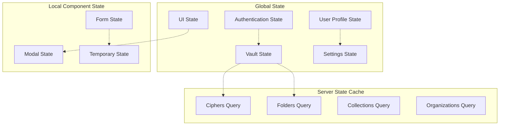

### State Management Patterns

#### Authentication State
```typescript
export interface AuthState {
  isAuthenticated: boolean;
  userId: string | null;
  email: string | null;
  authStatus: 'logged-out' | 'locked' | 'unlocked';
  biometricsEnabled: boolean;
  twoFactorEnabled: boolean;
}

export const [authState, setAuthState] = createStore<AuthState>({
  isAuthenticated: false,
  userId: null,
  email: null,
  authStatus: 'logged-out',
  biometricsEnabled: false,
  twoFactorEnabled: false,
});
```

#### Advanced Vault State with TanStack Query
```typescript
export function createVaultQueries(userId: string) {
  const queryClient = useQueryClient();

  // Main ciphers query with advanced features
  const ciphersQuery = createQuery(() => ({
    queryKey: ['ciphers', userId],
    queryFn: async () => {
      const ciphers = await invoke('get_all_ciphers', { userId });
      return ciphers as CipherView[];
    },
    staleTime: 1000 * 60 * 5, // 5 minutes
    gcTime: 1000 * 60 * 30, // 30 minutes cache
    refetchOnWindowFocus: true, // Background sync when window focused
    refetchOnReconnect: true, // Sync on network reconnect
    refetchInterval: 1000 * 60 * 15, // Background refresh every 15 minutes
    networkMode: 'offlineFirst', // Offline-first strategy
    placeholderData: (previousData) => previousData, // Keep previous data while refetching
    retry: (failureCount, error) => {
      if (failureCount < 3 && isNetworkError(error)) {
        return true;
      }
      return false;
    },
    retryDelay: (attemptIndex) => Math.min(1000 * 2 ** attemptIndex, 30000),
  }));

  // Optimistic mutations for better UX
  const saveCipherMutation = createMutation(() => ({
    mutationFn: async (cipher: CipherView) => {
      return await invoke('save_cipher', { cipher });
    },
    onMutate: async (newCipher) => {
      // Cancel outgoing refetches
      await queryClient.cancelQueries({ queryKey: ['ciphers', userId] });

      // Snapshot previous value
      const previousCiphers = queryClient.getQueryData(['ciphers', userId]);

      // Optimistically update
      queryClient.setQueryData(['ciphers', userId], (old: CipherView[] = []) => {
        const existingIndex = old.findIndex(c => c.id === newCipher.id);
        if (existingIndex >= 0) {
          const updated = [...old];
          updated[existingIndex] = newCipher;
          return updated;
        }
        return [...old, newCipher];
      });

      return { previousCiphers };
    },
    onError: (err, { cipherId, updates }, context) => {
      // Rollback on error
      queryClient.setQueryData(['ciphers', userId], context?.previousCiphers);
    },
    onSettled: () => {
      // Always refetch after error or success
      queryClient.invalidateQueries({ queryKey: ['ciphers', userId] });
    },
  }));

  // Background sync mutation
  const syncMutation = createMutation(() => ({
    mutationFn: async () => {
      return await invoke('sync_vault', { userId });
    },
    onSuccess: () => {
      queryClient.invalidateQueries({ queryKey: ['ciphers', userId] });
      queryClient.invalidateQueries({ queryKey: ['folders', userId] });
      queryClient.invalidateQueries({ queryKey: ['collections', userId] });
    },
  }));

  return { 
    ciphersQuery, 
    saveCipherMutation, 
    syncMutation,
    // Helper for manual sync
    syncVault: () => syncMutation.mutate(),
  };
}

// Network error detection helper
function isNetworkError(error: unknown): boolean {
  return error instanceof Error && 
    (error.message.includes('network') || 
     error.message.includes('fetch') ||
     error.message.includes('timeout'));
}
```

## TanStack Query Best Practices & Advanced Features

### Overview

TanStack Query is the backbone of our server state management, providing powerful features for data synchronization, caching, and offline support. This section covers advanced usage patterns and best practices for new developers.

### Core Configuration

#### Global Query Client Setup
```typescript
// src/lib/query-client.ts
import { QueryClient } from "@tanstack/solid-query";

export const queryClient = new QueryClient({
  defaultOptions: {
    queries: {
      // Stale time - how long data is considered fresh
      staleTime: 1000 * 60 * 5, // 5 minutes
      
      // Garbage collection time - how long inactive data stays in cache
      gcTime: 1000 * 60 * 30, // 30 minutes
      
      // Background refetch strategies
      refetchOnWindowFocus: true, // Sync when user returns to app
      refetchOnReconnect: true, // Sync when network reconnects
      refetchOnMount: true, // Refetch when component mounts
      
      // Retry configuration
      retry: (failureCount, error) => {
        // Don't retry authentication errors
        if (error.message.includes('401') || error.message.includes('403')) {
          return false;
        }
        // Retry network errors up to 3 times
        return failureCount < 3;
      },
      
      // Exponential backoff for retries
      retryDelay: (attemptIndex) => Math.min(1000 * 2 ** attemptIndex, 30000),
      
      // Offline-first strategy
      networkMode: 'offlineFirst',
    },
    mutations: {
      // Global mutation retry for network errors
      retry: (failureCount, error) => {
        return failureCount < 2 && isNetworkError(error);
      },
      networkMode: 'offlineFirst',
    },
  },
});
```

### Advanced Query Patterns

#### 1. Hierarchical Data Queries
```typescript
// Vault hierarchy: User → Folders → Ciphers
export function createVaultDataQueries(userId: string) {
  const queryClient = useQueryClient();

  // User profile query
  const userQuery = createQuery(() => ({
    queryKey: ['user', userId],
    queryFn: () => invoke('get_user_profile', { userId }),
    staleTime: 1000 * 60 * 15, // User data changes less frequently
  }));

  // Folders query with dependency
  const foldersQuery = createQuery(() => ({
    queryKey: ['folders', userId],
    queryFn: () => invoke('get_folders', { userId }),
    enabled: () => !!userQuery.data, // Only fetch if user data exists
    staleTime: 1000 * 60 * 10,
  }));

  // Ciphers query with folder dependency
  const ciphersQuery = createQuery(() => ({
    queryKey: ['ciphers', userId],
    queryFn: () => invoke('get_ciphers', { userId }),
    enabled: () => !!foldersQuery.data,
    select: (data: CipherView[]) => {
      // Transform data on the client side
      return data.map(cipher => ({
        ...cipher,
        folderName: foldersQuery.data?.find(f => f.id === cipher.folderId)?.name || 'No Folder'
      }));
    },
  }));

  return { userQuery, foldersQuery, ciphersQuery };
}
```

#### 2. Infinite Queries for Large Datasets
```typescript
// For large vault datasets with pagination
export function createInfiniteCiphersQuery(userId: string, searchQuery?: string) {
  return createInfiniteQuery(() => ({
    queryKey: ['ciphers', 'infinite', userId, searchQuery],
    queryFn: ({ pageParam = 0 }) => 
      invoke('get_ciphers_paginated', { 
        userId, 
        page: pageParam, 
        limit: 50,
        search: searchQuery 
      }),
    getNextPageParam: (lastPage, pages) => {
      return lastPage.hasMore ? pages.length : undefined;
    },
    staleTime: 1000 * 60 * 5,
    placeholderData: (previousData) => previousData,
  }));
}
```

#### 3. Optimistic Updates with Rollback
```typescript
export function createCipherMutations(userId: string) {
  const queryClient = useQueryClient();

  const updateCipherMutation = createMutation(() => ({
    mutationFn: async ({ cipherId, updates }: { cipherId: string, updates: Partial<CipherView> }) => {
      return await invoke('update_cipher', { cipherId, updates });
    },

    // Optimistic update
    onMutate: async ({ cipherId, updates }) => {
      // Cancel any outgoing refetches
      await queryClient.cancelQueries({ queryKey: ['ciphers', userId] });

      // Snapshot the previous value
      const previousCiphers = queryClient.getQueryData(['ciphers', userId]);

      // Optimistically update to the new value
      queryClient.setQueryData(['ciphers', userId], (old: CipherView[] = []) => {
        return old.map(cipher => 
          cipher.id === cipherId 
            ? { ...cipher, ...updates, updatedAt: new Date().toISOString() }
            : cipher
        );
      });

      // Return a context object with the snapshotted value
      return { previousCiphers, cipherId, updates };
    },

    // If the mutation fails, use the context returned from onMutate to roll back
    onError: (err, { cipherId, updates }, context) => {
      if (context?.previousCiphers) {
        queryClient.setQueryData(['ciphers', userId], context.previousCiphers);
      }
      
      // Show error notification
      showToast({
        type: 'error',
        message: `Failed to update ${updates.name || 'cipher'}: ${err.message}`,
      });
    },

    // Always refetch after error or success
    onSettled: () => {
      queryClient.invalidateQueries({ queryKey: ['ciphers', userId] });
    },

    onSuccess: (data, { updates }) => {
      showToast({
        type: 'success',
        message: `${updates.name || 'Cipher'} updated successfully`,
      });
    },
  }));

  return { updateCipherMutation };
}
```

### Offline Support Strategies

#### 1. Offline Detection and UI Feedback
```typescript
// src/hooks/useNetworkStatus.ts
import { createSignal, onMount, onCleanup } from "solid-js";

export function useNetworkStatus() {
  const [isOnline, setIsOnline] = createSignal(navigator.onLine);

  onMount(() => {
    const handleOnline = () => setIsOnline(true);
    const handleOffline = () => setIsOnline(false);

    window.addEventListener('online', handleOnline);
    window.addEventListener('offline', handleOffline);

    onCleanup(() => {
      window.removeEventListener('online', handleOnline);
      window.removeEventListener('offline', handleOffline);
    });
  });

  return isOnline;
}

// Usage in components
function VaultHeader() {
  const isOnline = useNetworkStatus();

  return (
    <div class="vault-header">
      <h1>My Vault</h1>
      {!isOnline() && (
        <div class="alert alert-warning">
          <span>You're offline. Changes will sync when connection is restored.</span>
        </div>
      )}
    </div>
  );
}
```

#### 2. Offline Queue for Mutations
```typescript
// src/lib/offline-manager.ts
interface OfflineAction {
  id: string;
  action: 'create' | 'update' | 'delete';
  data: any;
  timestamp: number;
}

class OfflineManager {
  private queue: OfflineAction[] = [];
  private isProcessing = false;

  addToQueue(action: OfflineAction) {
    this.queue.push(action);
    this.saveToLocalStorage();
  }

  async processQueue() {
    if (this.isProcessing || !navigator.onLine) return;
    
    this.isProcessing = true;
    
    while (this.queue.length > 0) {
      const action = this.queue.shift()!;
      
      try {
        await this.executeAction(action);
      } catch (error) {
        // Put action back in queue if it fails
        this.queue.unshift(action);
        break;
      }
    }
    
    this.isProcessing = false;
    this.saveToLocalStorage();
  }

  private async executeAction(action: OfflineAction) {
    switch (action.action) {
      case 'create':
        return await invoke('create_cipher', action.data);
      case 'update':
        return await invoke('update_cipher', action.data);
      case 'delete':
        return await invoke('delete_cipher', action.data);
    }
  }

  private saveToLocalStorage() {
    localStorage.setItem('offline_queue', JSON.stringify(this.queue));
  }
}

export const offlineManager = new OfflineManager();
```

### Background Synchronization

#### 1. Intelligent Background Sync
```typescript
// src/hooks/useBackgroundSync.ts
export function useBackgroundSync(userId: string) {
  const queryClient = useQueryClient();
  const [lastSyncTime, setLastSyncTime] = createSignal<Date | null>(null);

  // Sync when window gains focus
  createEventListener(window, "focus", () => {
    const now = new Date();
    const lastSync = lastSyncTime();
    
    // Only sync if it's been more than 5 minutes since last sync
    if (!lastSync || now.getTime() - lastSync.getTime() > 5 * 60 * 1000) {
      syncVaultData();
    }
  });

  // Sync when network reconnects
  createEventListener(window, "online", () => {
    syncVaultData();
    offlineManager.processQueue(); // Process offline actions
  });

  const syncVaultData = async () => {
    try {
      // Invalidate all queries to force fresh data
      await queryClient.invalidateQueries({ queryKey: ['ciphers', userId] });
      await queryClient.invalidateQueries({ queryKey: ['folders', userId] });
      await queryClient.invalidateQueries({ queryKey: ['collections', userId] });
      
      setLastSyncTime(new Date());
    } catch (error) {
      console.error('Background sync failed:', error);
    }
  };

  return { lastSyncTime, syncVaultData };
}
```

#### 2. Periodic Background Refresh
```typescript
// src/hooks/usePeriodicSync.ts
export function usePeriodicSync(userId: string, intervalMinutes: number = 15) {
  const queryClient = useQueryClient();
  
  createEffect(() => {
    const interval = setInterval(() => {
      // Only sync if user is active and online
      if (document.visibilityState === 'visible' && navigator.onLine) {
        queryClient.invalidateQueries({ 
          queryKey: ['ciphers', userId],
          refetchType: 'active' // Only refetch active queries
        });
      }
    }, intervalMinutes * 60 * 1000);

    onCleanup(() => clearInterval(interval));
  });
}
```

### Query Invalidation Strategies

#### 1. Smart Invalidation Patterns
```typescript
// src/lib/query-invalidation.ts
export class QueryInvalidationManager {
  constructor(private queryClient: QueryClient) {}

  // Invalidate related queries when cipher is updated
  async invalidateAfterCipherUpdate(cipherId: string, userId: string) {
    await Promise.all([
      // Specific cipher query
      this.queryClient.invalidateQueries({ 
        queryKey: ['cipher', cipherId] 
      }),
      
      // All ciphers for user
      this.queryClient.invalidateQueries({ 
        queryKey: ['ciphers', userId] 
      }),
      
      // Search results that might include this cipher
      this.queryClient.invalidateQueries({ 
        queryKey: ['ciphers', 'search'], 
        exact: false 
      }),
      
      // Recently accessed ciphers
      this.queryClient.invalidateQueries({ 
        queryKey: ['ciphers', 'recent', userId] 
      }),
    ]);
  }

  // Invalidate after folder operations
  async invalidateAfterFolderUpdate(folderId: string, userId: string) {
    await Promise.all([
      this.queryClient.invalidateQueries({ queryKey: ['folders', userId] }),
      this.queryClient.invalidateQueries({ queryKey: ['ciphers', userId] }), // Ciphers display folder names
    ]);
  }

  // Global invalidation for sync operations
  async invalidateAllUserData(userId: string) {
    await this.queryClient.invalidateQueries({ 
      predicate: (query) => {
        return query.queryKey.includes(userId);
      }
    });
  }
}
```

### Performance Optimization

#### 1. Query Key Factory Pattern
```typescript
// src/lib/query-keys.ts
export const queryKeys = {
  // User-related queries
  user: (userId: string) => ['user', userId] as const,
  userProfile: (userId: string) => [...queryKeys.user(userId), 'profile'] as const,
  userSettings: (userId: string) => [...queryKeys.user(userId), 'settings'] as const,

  // Vault-related queries
  vault: (userId: string) => ['vault', userId] as const,
  ciphers: (userId: string) => [...queryKeys.vault(userId), 'ciphers'] as const,
  cipher: (userId: string, cipherId: string) => [...queryKeys.ciphers(userId), cipherId] as const,
  
  // Search queries
  search: (userId: string, query: string) => [...queryKeys.vault(userId), 'search', query] as const,
  
  // Folders and collections
  folders: (userId: string) => [...queryKeys.vault(userId), 'folders'] as const,
  collections: (userId: string) => [...queryKeys.vault(userId), 'collections'] as const,

  // Recent and favorites
  recentCiphers: (userId: string) => [...queryKeys.ciphers(userId), 'recent'] as const,
  favoriteCiphers: (userId: string) => [...queryKeys.ciphers(userId), 'favorites'] as const,
} as const;

// Usage
const ciphersQuery = createQuery(() => ({
  queryKey: queryKeys.ciphers(userId),
  queryFn: () => invoke('get_all_ciphers', { userId }),
}));
```

#### 2. Data Transformation and Selection
```typescript
// Efficient data transformation using select
export function useCiphersByFolder(userId: string) {
  return createQuery(() => ({
    queryKey: queryKeys.ciphers(userId),
    queryFn: () => invoke('get_all_ciphers', { userId }),
    select: (ciphers: CipherView[]) => {
      // Group ciphers by folder
      return ciphers.reduce((acc, cipher) => {
        const folderId = cipher.folderId || 'no-folder';
        if (!acc[folderId]) {
          acc[folderId] = [];
        }
        acc[folderId].push(cipher);
        return acc;
      }, {} as Record<string, CipherView[]>);
    },
    // This query will only re-render when the transformation result changes
    staleTime: 1000 * 60 * 5,
  }));
}
```

### Developer Guidelines

#### 1. Query Naming Conventions
- Use descriptive, hierarchical query keys: `['user', userId, 'vault', 'ciphers']`
- Always include user context in multi-tenant queries
- Use consistent key factories to avoid typos
- Prefix experimental or temporary queries with `_temp_`

#### 2. Error Handling Best Practices
```typescript
// Centralized error handling
function useQueryWithErrorHandling<T>(queryConfig: any) {
  return createQuery(() => ({
    ...queryConfig,
    onError: (error: Error) => {
      // Log to monitoring service
      console.error('Query failed:', error);
      
      // Show user-friendly error
      if (error.message.includes('401')) {
        showToast({ type: 'error', message: 'Please log in again' });
        // Redirect to login
      } else if (error.message.includes('network')) {
        showToast({ type: 'warning', message: 'Network error. Trying again...' });
      } else {
        showToast({ type: 'error', message: 'Something went wrong. Please try again.' });
      }
    },
  }));
}
```

#### 3. Testing Query Hooks
```typescript
// Testing TanStack Query hooks
import { QueryClient, QueryClientProvider } from '@tanstack/solid-query';
import { renderHook } from '@solidjs/testing-library';

describe('useCiphersQuery', () => {
  let queryClient: QueryClient;

  beforeEach(() => {
    queryClient = new QueryClient({
      defaultOptions: {
        queries: { retry: false },
        mutations: { retry: false },
      },
    });
  });

  it('should fetch ciphers successfully', async () => {
    const wrapper = ({ children }) => (
      <QueryClientProvider client={queryClient}>
        {children}
      </QueryClientProvider>
    );

    const { result } = renderHook(() => useCiphersQuery('user-1'), { wrapper });

    await waitFor(() => {
      expect(result.isSuccess).toBe(true);
    });
  });
});
```

## Routing & Navigation

The project's routing is managed by TanStack Router, using a file-based system for type-safety and automatic code splitting. For a complete overview of the route structure, configuration, and advanced patterns like route guards and typed navigation, please refer to the definitive guide.

> **📚 [View the Complete Project Structure and Routing Guide](./development-guide/00-project-structure-and-routing.md)**

## Internationalization (i18n)

### i18n Architecture

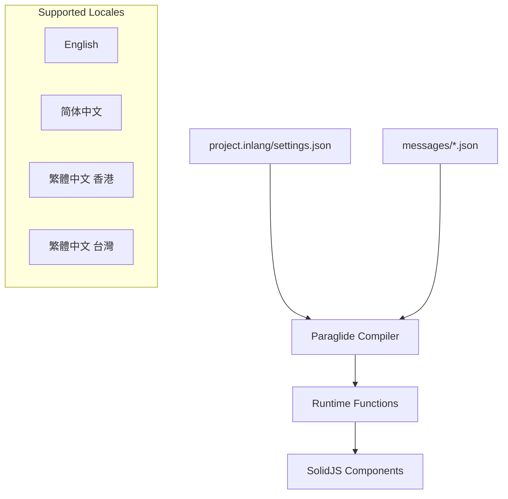

### Implementation Pattern
```typescript
// Message definitions in messages/en.json
{
  "nav.home": "Home",
  "nav.about": "About",
  "nav.dashboard": "Dashboard",
  "auth.login.title": "Sign In",
  "vault.items.count": "You have {count} items"
}

// Usage in components
import { 
  "nav.home" as nav_home,
  "vault.items.count" as vault_items_count
} from "@/paraglide/messages/_index.js";

function Navigation() {
  return (
    <Link to="/">{nav_home()}</Link>
  );
}

function VaultStats(props: { count: number }) {
  return (
    <p>{vault_items_count({ count: props.count })}</p>
  );
}
```

### Language Switching
```typescript
// Language Switcher Component
import { setLocale, locales, getLocale } from "@/paraglide/runtime.js";

export function LanguageSwitcher() {
  const currentLang = getLocale();

  return (
    <select 
      value={currentLang}
      onChange={(e) => setLocale(e.target.value as Locale)}
    >
      {locales.map(locale => (
        <option value={locale}>{getLanguageName(locale)}</option>
      ))}
    </select>
  );
}
```

## Build System & Tooling

### Build Pipeline

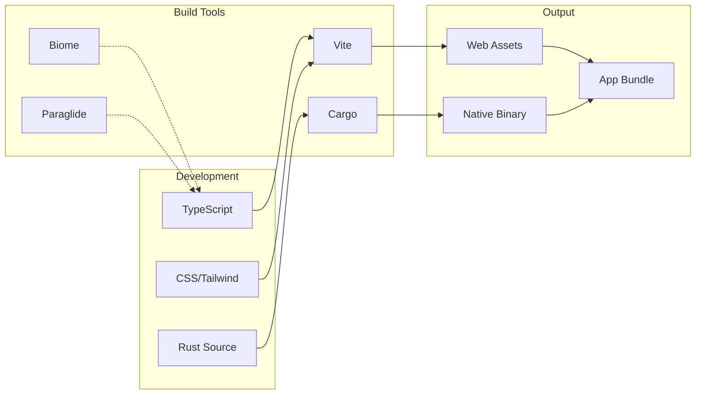

### Development Scripts
```json
{
  "scripts": {
    "dev": "vite",
    "build": "vite build",
    "serve": "vite preview",
    "tauri": "tauri",
    "tauri:dev": "tauri dev",
    "tauri:build": "tauri build",
    "lint": "biome check .",
    "lint:fix": "biome check --write .",
    "translate": "inlang machine translate --project project.inlang"
  }
}
```

### Vite Configuration
```typescript
export default defineConfig({
  plugins: [
    tanstackRouter({
      target: "solid",
      autoCodeSplitting: true,
      routesDirectory: "./src/routes",
      generatedRouteTree: "./src/routeTree.gen.ts",
    }),
    tsconfigPaths(),
    paraglideVitePlugin({
      project: "./project.inlang",
      outdir: "./src/paraglide",
      strategy: ["preferredLanguage", "localStorage"],
    }),
    solid(),
    tailwindcss(),
  ],
  server: {
    port: 5173,
    strictPort: true,
  },
});
```

## Development Patterns

### Error Handling Patterns

#### Frontend Error Boundaries
```typescript
export function ErrorBoundary(props: ErrorBoundaryProps) {
  return (
    <SolidErrorBoundary fallback={(error, reset) => (
      <div class="alert alert-error">
        <h3>Something went wrong!</h3>
        <p>{error.message}</p>
        <button onClick={reset}>Try again</button>
      </div>
    )}>
      {props.children}
    </SolidErrorBoundary>
  );
}
```

#### Backend Error Types
```rust
#[derive(Error, Debug, Serialize, Deserialize)]
pub enum AppError {
    #[error("Authentication failed: {message}")]
    AuthenticationError { message: String },
    
    #[error("Encryption error: {operation}")]
    CryptographyError { operation: String },
    
    #[error("Database error: {message}")]
    DatabaseError { message: String },
    
    #[error("Network error: {status}")]
    NetworkError { status: u16, message: String },
}
```

### Testing Patterns

#### Frontend Testing
```typescript
// Component Testing with Solid Testing Library
import { render, screen } from "@solidjs/testing-library";
import { describe, it, expect } from "vitest";

describe("LoginForm", () => {
  it("should submit form with email and password", async () => {
    const mockLogin = vi.fn();
    render(() => <LoginForm onLogin={mockLogin} />);
    
    // Test implementation
  });
});
```

#### Backend Testing
```rust
#[cfg(test)]
mod tests {
    use super::*;

    #[tokio::test]
    async fn test_encrypt_decrypt_cycle() {
        let crypto_service = CryptoService::new();
        let key = crypto_service.generate_key(64).await.unwrap();
        let plaintext = "test message";
        
        let encrypted = crypto_service.encrypt_string(plaintext, &key).await.unwrap();
        let decrypted = crypto_service.decrypt_string(&encrypted, &key).await.unwrap();
        
        assert_eq!(plaintext, decrypted);
    }
}
```

## Performance Considerations

### Frontend Performance

#### Code Splitting & Lazy Loading
```typescript
// Route-based code splitting (automatic with TanStack Router)
const VaultComponent = lazy(() => import("./VaultComponent"));

// Component-based lazy loading
const HeavyModal = lazy(() => import("./HeavyModal"));

function App() {
  return (
    <Suspense fallback={<LoadingSpinner />}>
      <Routes />
    </Suspense>
  );
}
```

#### Reactive Performance Optimizations
```typescript
// Fine-grained reactivity
const [vaultState, setVaultState] = createStore({
  ciphers: [],
  selectedFolder: null,
  searchQuery: '',
});

// Memoized computations
const filteredCiphers = createMemo(() => {
  return vaultState.ciphers.filter(cipher => 
    cipher.name.toLowerCase().includes(vaultState.searchQuery.toLowerCase())
  );
});

// Batched updates
batch(() => {
  setVaultState('ciphers', newCiphers);
  setVaultState('lastSync', new Date());
});
```

### Backend Performance

#### Async Operations
```rust
// Concurrent operations with tokio
pub async fn sync_vault_data(&self) -> Result<(), AppError> {
    let (ciphers, folders, collections) = tokio::try_join!(
        self.sync_ciphers(),
        self.sync_folders(),
        self.sync_collections()
    )?;
    
    self.save_sync_data(ciphers, folders, collections).await?;
    Ok(())
}
```

#### Database Optimization
```rust
// Connection pooling
pub struct Database {
    pool: SqlitePool,
}

// Prepared statements and transactions
impl Database {
    pub async fn save_ciphers(&self, ciphers: Vec<CipherData>) -> Result<(), DbError> {
        let mut tx = self.pool.begin().await?;
        
        for cipher in ciphers {
            sqlx::query!(
                "INSERT OR REPLACE INTO ciphers (id, data) VALUES (?, ?)",
                cipher.id,
                serde_json::to_string(&cipher)?
            )
            .execute(&mut *tx)
            .await?;
        }
        
        tx.commit().await?;
        Ok(())
    }
}
```

## Security Considerations

### Threat Model

#### Assets to Protect
- **Master Passwords**: User authentication credentials
- **Encryption Keys**: Cryptographic keys for data protection
- **Vault Data**: Encrypted passwords and sensitive information
- **Session Tokens**: Authentication and authorization tokens

#### Threat Actors
- **Malicious Software**: Malware, keyloggers, screen scrapers
- **Network Attackers**: Man-in-the-middle, traffic analysis
- **System Administrators**: Privileged access abuse
- **Physical Attackers**: Device theft, unauthorized access

#### Attack Vectors
- **Memory Dumping**: Extracting sensitive data from memory
- **Network Interception**: Capturing network traffic
- **Local Privilege Escalation**: Gaining elevated system access
- **Social Engineering**: Tricking users into revealing information

### Security Controls Implementation

#### Memory Protection
```rust
use zeroize::{Zeroize, ZeroizeOnDrop};

#[derive(ZeroizeOnDrop)]
pub struct SecretKey {
    key: Vec<u8>,
}

impl SecretKey {
    pub fn new(key: Vec<u8>) -> Self {
        Self { key }
    }
}

impl Drop for SecretKey {
    fn drop(&mut self) {
        self.key.zeroize();
    }
}
```

#### Secure Communication
```rust
// TLS configuration for external API calls
pub fn create_secure_client() -> Result<Client, reqwest::Error> {
    Client::builder()
        .min_tls_version(tls::Version::TLS_1_2)
        .https_only(true)
        .timeout(Duration::from_secs(30))
        .build()
}
```

#### Input Validation
```rust
// Comprehensive input validation
pub fn validate_email(email: &str) -> Result<(), ValidationError> {
    if email.is_empty() {
        return Err(ValidationError::Required("email"));
    }
    
    if !email.contains('@') || email.len() > 320 {
        return Err(ValidationError::Invalid("email"));
    }
    
    Ok(())
}
```

## Deployment Architecture

### Build Targets

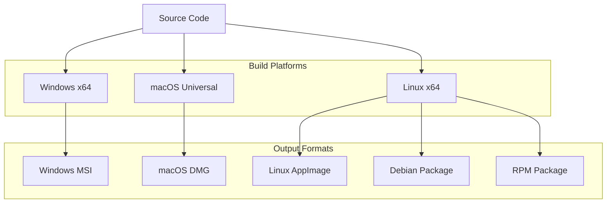

### Distribution Strategy

#### Release Channels
- **Stable**: Production-ready releases with full testing
- **Beta**: Feature-complete previews for testing
- **Nightly**: Automated builds from main branch

#### Update Mechanism
```rust
// Auto-update configuration in Tauri
{
  "updater": {
    "active": true,
    "endpoints": [
      "https://releases.example.com/{{target}}/{{arch}}/{{current_version}}"
    ],
    "dialog": true,
    "pubkey": "UPDATE_PUBLIC_KEY"
  }
}
```

### Installation Architecture

#### System Integration
- **Registry Entries**: Windows registry for file associations
- **LaunchServices**: macOS application registration
- **Desktop Files**: Linux desktop environment integration
- **Auto-start**: System startup integration
- **URL Handlers**: Custom protocol registration (bitwarden://)

## Future Architecture Considerations

### Scalability Planning

#### Performance Enhancements
- **Database Optimization**: Consider SQLite extensions or alternative storage
- **Crypto Acceleration**: Hardware-accelerated cryptography
- **Memory Management**: Advanced memory optimization techniques
- **Network Optimization**: HTTP/3 and connection pooling improvements

#### Feature Extensibility
- **Plugin System**: Modular architecture for extensions
- **Theme System**: Customizable UI themes and layouts
- **Custom Fields**: Enhanced support for custom data types
- **Integration APIs**: Third-party service integrations

### Technology Evolution

#### Frontend Improvements
- **SolidJS Evolution**: Keep up with SolidJS ecosystem updates
- **Web Components**: Consider web components for better reusability
- **Progressive Enhancement**: Improve offline capabilities
- **Accessibility**: Enhanced a11y support and WCAG compliance

#### Backend Enhancements
- **Rust Ecosystem**: Leverage new Rust crates and improvements
- **Tauri Evolution**: Adopt new Tauri features and capabilities
- **Platform APIs**: Deeper OS integration opportunities
- **Security Hardening**: Continuous security improvements

### Migration Strategies

#### Data Migration
- **Schema Evolution**: Database schema migration strategies
- **Configuration Migration**: Settings and preferences migration
- **Key Migration**: Cryptographic key rotation and migration
- **Backup Strategies**: Comprehensive backup and restore mechanisms

#### Platform Expansion
- **Mobile Support**: Tauri mobile support evaluation
- **Web Extension**: Browser extension compatibility
- **Enterprise Features**: Advanced enterprise management capabilities
- **Cloud Sync**: Enhanced synchronization capabilities

---

## Conclusion

Chiikawarden's updated architecture leverages the full power of Tauri's plugin ecosystem to deliver a robust, secure, and high-performance password manager. The hybrid storage approach combining Stronghold, encrypted SQLite, and memory caching provides enterprise-grade security while maintaining excellent user experience.

The architecture emphasizes:

### Enhanced Security
- **Military-grade key storage** via Tauri Stronghold for critical secrets
- **Defense in depth** with multi-layered encryption strategies  
- **Hardware-backed security** through platform-specific integrations
- **Memory safety** with Rust's ownership model and automatic zeroization
- **Zero-knowledge architecture** with client-side encryption

### Performance Excellence
- **Native performance** through Rust backend with optimized crypto operations
- **Efficient caching** with memory-based session data for instant access
- **Reactive UI** with SolidJS fine-grained reactivity
- **Advanced offline capabilities** with TanStack Query's sophisticated sync strategies
- **Platform optimization** via dedicated Tauri plugins

### Developer Experience
- **Type safety** across the entire TypeScript/Rust stack
- **Plugin ecosystem** providing battle-tested security and system integrations
- **Modern tooling** with Biome, Bun, and comprehensive testing frameworks
- **Clear architectural boundaries** between frontend, backend, and storage layers
- **Comprehensive error handling** and debugging capabilities

### Operational Benefits
- **Cross-platform consistency** with single codebase for Windows, macOS, and Linux
- **Automatic updates** via Tauri's built-in updater plugin
- **System integration** through OS-specific plugins for seamless user experience
- **Backup and recovery** with encrypted local storage and sync capabilities
- **Enterprise readiness** with support for organizational policies and compliance

This hybrid architecture represents a significant advancement over traditional password manager implementations, providing the security of specialized vault solutions with the performance and user experience of modern desktop applications. The strategic use of Tauri plugins ensures long-term maintainability while leveraging the Rust ecosystem's security and performance advantages.

This document serves as the authoritative reference for understanding and evolving the Chiikawarden application architecture.