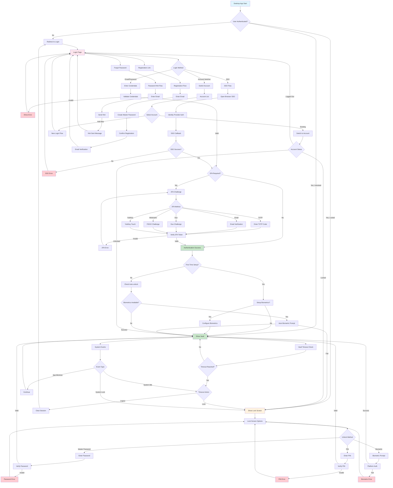
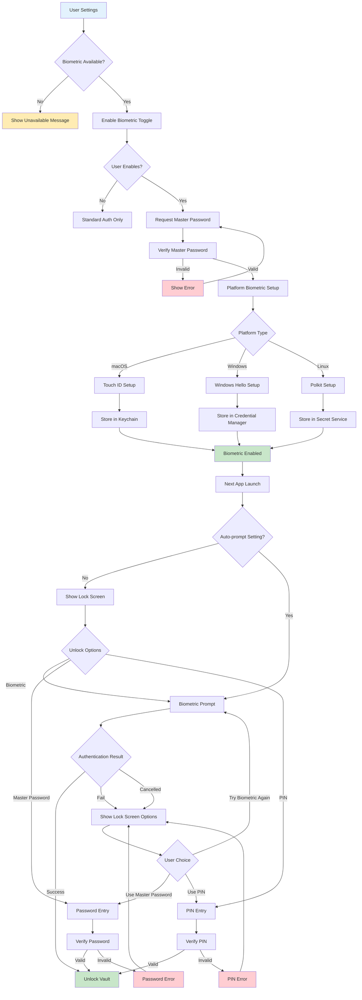
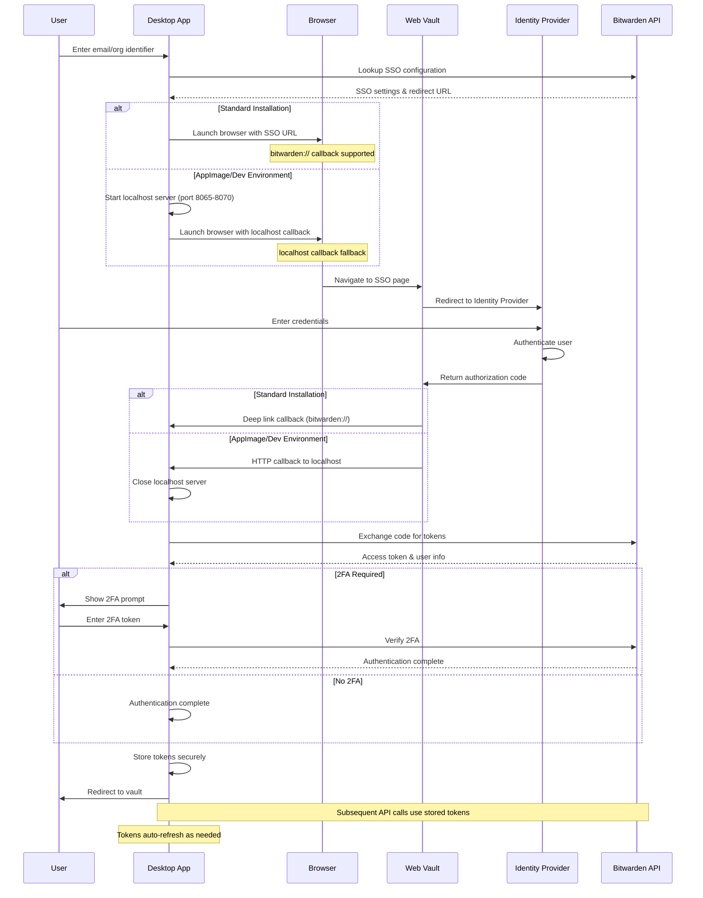

# Bitwarden Desktop Authentication Flow Analysis

## Overview

This document provides a comprehensive analysis of the authentication flow in the Bitwarden Desktop application, including login, registration, password reset, two-factor authentication, SSO, biometric authentication, and account management.

## Authentication Flow Components

### 1. Login Flow

#### Standard Email/Password Login
- **Entry Point**: `/login` route
- **Component**: `LoginComponent` from `@bitwarden/auth/angular`
- **Service**: `DesktopLoginComponentService` extends `DefaultLoginComponentService`
- **Key Features**:
  - Email validation and storage via `LoginEmailService`
  - Environment selector for self-hosted instances
  - Remember email functionality
  - Integration with account switcher for multi-account support

#### Login Process:
1. User enters email and password
2. `LoginComponent` validates input
3. `LoginStrategyService` handles authentication
4. On success, redirects to vault or handles 2FA requirement
5. On failure, displays appropriate error messages

### 2. Registration Flow

#### Account Creation
- **Routes**:
  - `/signup` - Initial registration form
  - `/finish-signup` - Complete registration process
- **Components**:
  - `RegistrationStartComponent` - Email and master password setup
  - `RegistrationFinishComponent` - Account finalization
  - `RegistrationStartSecondaryComponent` - Login link in sidebar

#### Registration Process:
1. User provides email and creates master password
2. Password strength validation and policy enforcement
3. Account creation via API
4. Email verification (if required)
5. Automatic login or redirect to login page

### 3. Password Reset & Recovery

#### Forgot Password (Password Hint)
- **Route**: `/hint`
- **Component**: `PasswordHintComponent`
- **Process**:
  1. User enters email address
  2. System sends password hint to email
  3. Success message displayed
  4. Redirect to login page

#### Account Recovery
- **Service**: `PasswordResetEnrollmentService`
- **Features**:
  - Organization-based password reset
  - Admin-initiated password reset
  - Encrypted key recovery using organization public keys

### 4. Two-Factor Authentication (2FA)

#### Supported Methods
- **Route**: `/2fa`
- **Component**: `TwoFactorAuthComponent`
- **Providers**:
  - Authenticator apps (TOTP)
  - Email verification
  - YubiKey
  - Duo Security
  - WebAuthn/FIDO2

#### 2FA Process:
1. Primary authentication completed
2. System determines available 2FA methods
3. User selects preferred method
4. Token/challenge verification
5. Optional "Remember this device" setting
6. Complete authentication or show additional options

### 5. Single Sign-On (SSO)

#### SSO Implementation
- **Service**: `DesktopLoginComponentService`
- **Callback Handling**: `SSOLocalhostCallbackService`
- **Deep Link Support**: `bitwarden://` protocol

#### SSO Flow:
1. User enters organization identifier or email
2. System looks up SSO configuration
3. **Desktop-specific behavior**:
   - Opens external browser window to web vault SSO page
   - For AppImage/Dev: Uses localhost callback (ports 8065-8070)
   - For standard installs: Uses protocol-based callback
4. User completes authentication with identity provider
5. Callback returns authorization code
6. Desktop app exchanges code for tokens
7. User authenticated and redirected to vault

### 6. Biometric Authentication

#### Platform Support
- **macOS**: Touch ID via Keychain Services
- **Windows**: Windows Hello via Windows API
- **Linux**: Polkit authentication

#### Services:
- `DesktopBiometricsService` - Main interface
- `OsBiometricsService` - Platform-specific implementations
- `BiometricStateService` - Settings and state management

#### Biometric Flow:
1. User enables biometric unlock in settings
2. Master password required for initial setup
3. User key encrypted and stored in platform keystore
4. On subsequent unlocks:
   - Biometric prompt displayed
   - Platform authentication required
   - Encrypted key retrieved and decrypted
   - User unlocked without password entry

### 7. Lock Screen & Session Management

#### Lock Mechanisms
- **Component**: `LockComponent` from `@bitwarden/key-management-ui`
- **Service**: `DesktopLockComponentService`
- **Triggers**:
  - Manual lock action
  - Vault timeout (configurable)
  - System idle detection
  - System lock/screensaver activation

#### Unlock Options:
- Master password
- PIN (if enabled)
- Biometric authentication (if available and enabled)

### 8. Account Switching & Multi-Account Support

#### Account Management
- **Component**: `AccountSwitcherComponent`
- **Service**: `AccountService`
- **Features**:
  - Multiple account support
  - Quick account switching
  - Per-account authentication state
  - Biometric settings per account

#### Account Switching Flow:
1. User clicks account switcher
2. Available accounts displayed with status
3. User selects different account
4. System switches active account
5. Authentication state checked
6. Redirect to appropriate screen (vault/login/lock)

## Security Features

### 1. Vault Timeout
- Configurable timeout periods
- Actions: Lock or Logout
- System idle detection
- Window visibility awareness

### 2. Secure Storage
- Platform-specific credential storage
- Encrypted user keys
- Biometric key protection
- Token management with automatic cleanup

### 3. Device Trust
- Device registration and verification
- New device verification flow
- Device-specific settings and preferences

## Technical Architecture

### Key Services
- `AuthService` - Core authentication state management
- `TokenService` - Access token and refresh token handling
- `KeyService` - Cryptographic key management
- `VaultTimeoutService` - Session timeout and lock management
- `BiometricsService` - Platform biometric integration

### State Management
- Reactive state using RxJS observables
- Per-user authentication status tracking
- Persistent settings and preferences
- Secure token storage

### IPC Communication
- Electron main/renderer process communication
- Biometric authentication requests
- Platform-specific operations
- Deep link handling

## Error Handling

### Common Error Scenarios
- Invalid credentials
- Network connectivity issues
- 2FA token expiration
- Biometric authentication failures
- Account lockout conditions

### User Experience
- Clear error messages with i18n support
- Graceful degradation for unavailable features
- Retry mechanisms for transient failures
- Help links and support resources

## Detailed Flow Diagrams

### Main Authentication Flow



The comprehensive flow diagram shows the complete authentication journey from app startup to vault access, including all major decision points and error handling paths.

### Key Flow Characteristics:
1. **State-driven Navigation**: The app uses authentication status to determine routing
2. **Multiple Entry Points**: Users can access the app through various authentication methods
3. **Graceful Error Handling**: Each failure point provides clear feedback and recovery options
4. **Security-first Design**: Multiple layers of authentication and timeout protection

### Biometric Authentication Flow



### SSO Authentication Sequence



## Route Configuration

### Authentication Routes (`app-routing.module.ts`)
```typescript
// Main authentication routes
{ path: "login", component: LoginComponent }
{ path: "signup", component: RegistrationStartComponent }
{ path: "finish-signup", component: RegistrationFinishComponent }
{ path: "2fa", component: TwoFactorAuthComponent }
{ path: "hint", component: PasswordHintComponent }
{ path: "lock", component: LockComponent }
{ path: "sso", component: SsoComponent }
{ path: "device-verification", component: NewDeviceVerificationComponent }
```

### Guard Protection
- `authGuard`: Protects authenticated routes
- `unauthGuardFn()`: Protects unauthenticated routes
- `lockGuard()`: Handles locked state
- `tdeDecryptionRequiredGuard()`: Manages trusted device encryption
- `maxAccountsGuardFn()`: Limits concurrent accounts

## Platform-Specific Implementations

### Biometric Authentication

#### macOS (Touch ID)
- **Service**: `OsBiometricsMacService`
- **Storage**: macOS Keychain
- **Authentication**: Touch ID prompt via native APIs
- **Key Management**: Secure enclave integration

#### Windows (Windows Hello)
- **Service**: `OsBiometricsWindowsService`
- **Storage**: Windows Credential Manager
- **Authentication**: Windows Hello (fingerprint, face, PIN)
- **Key Management**: TPM-backed key storage

#### Linux (Polkit)
- **Service**: `OsBiometricsLinuxService`
- **Storage**: Secret Service (libsecret)
- **Authentication**: Polkit authorization framework
- **Key Management**: Encrypted storage with user session

### SSO Platform Differences

#### Standard Installation
- Uses `bitwarden://` protocol for callbacks
- Direct deep link handling
- Seamless browser-to-app transition

#### AppImage/Development
- Falls back to localhost callback server
- Ports 8065-8070 attempted sequentially
- 5-minute timeout for security
- Manual browser closure required

## Security Considerations

### Token Management
- Access tokens stored in secure platform storage
- Refresh tokens handled automatically
- Token cleanup on logout/timeout
- Per-account token isolation

### Key Derivation
- Master password never stored
- User keys derived from master password
- Biometric keys encrypted with user key
- Platform-specific key protection

### Session Security
- Configurable vault timeouts
- System event monitoring (lock, idle)
- Automatic lock on suspicious activity
- Secure memory handling

### Multi-Account Security
- Isolated account data
- Per-account authentication state
- Secure account switching
- Cross-account data protection

## Error Handling Patterns

### Network Errors
- Offline mode detection
- Retry mechanisms with exponential backoff
- Graceful degradation of features
- Clear user communication

### Authentication Errors
- Specific error messages for different failure types
- Rate limiting protection
- Account lockout prevention
- Recovery guidance

### Platform Errors
- Biometric unavailability handling
- Platform permission issues
- Hardware compatibility checks
- Fallback authentication methods

## Performance Optimizations

### Startup Performance
- Lazy loading of authentication components
- Cached authentication state
- Minimal initial bundle size
- Progressive feature loading

### Memory Management
- Secure memory clearing
- Efficient state management
- Garbage collection optimization
- Resource cleanup on logout

### Background Operations
- Efficient token refresh
- Background sync capabilities
- Minimal CPU usage when locked
- Power-aware operations

## Accessibility Features

### Keyboard Navigation
- Full keyboard accessibility
- Tab order optimization
- Screen reader support
- High contrast mode support

### Internationalization
- Multi-language support
- RTL language compatibility
- Cultural date/time formatting
- Localized error messages

## Development Guidelines

### Testing Strategy
- Unit tests for all authentication flows
- Integration tests for platform features
- End-to-end authentication scenarios
- Security-focused test cases

### Code Organization
- Modular service architecture
- Clear separation of concerns
- Platform abstraction layers
- Consistent error handling

### Security Best Practices
- Regular security audits
- Dependency vulnerability scanning
- Secure coding standards
- Privacy-by-design principles

## Conclusion

The Bitwarden Desktop authentication system provides a comprehensive, secure, and user-friendly authentication experience across multiple platforms. The modular architecture allows for platform-specific optimizations while maintaining consistent security standards and user experience patterns.

Key strengths include:
- Multi-factor authentication support
- Platform-native biometric integration
- Robust SSO implementation
- Comprehensive error handling
- Strong security foundations

This analysis serves as a foundation for understanding, maintaining, and extending the desktop authentication system.
