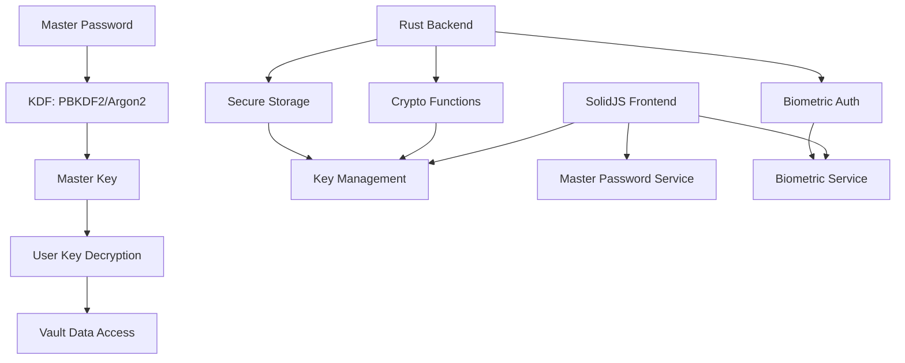

# Complete Tauri Key Management Implementation Guide

## 🎯 Overview

This guide provides a complete implementation of Bitwarden-style key management in a Tauri application, featuring:

- **Zero-knowledge architecture** - Server never sees master password
- **Strong encryption** - AES-256-CBC with HMAC-SHA256
- **Modern KDFs** - PBKDF2 and Argon2id support
- **Platform security** - Keychain integration and biometric authentication
- **Memory safety** - Automatic cleanup of sensitive data

## 🏗️ Architecture



## 📁 Project Structure

```
bitwarden-tauri/
├── src-tauri/
│   ├── src/
│   │   ├── crypto/
│   │   │   ├── mod.rs              # Core crypto types
│   │   │   ├── kdf.rs              # Key derivation (PBKDF2/Argon2)
│   │   │   ├── encryption.rs       # AES encryption/decryption
│   │   │   ├── keys.rs             # Key generation & RSA
│   │   │   ├── secure_storage.rs   # Platform keychain
│   │   │   └── biometrics.rs       # Biometric authentication
│   │   ├── commands/
│   │   │   ├── mod.rs
│   │   │   ├── crypto.rs           # Crypto Tauri commands
│   │   │   ├── storage.rs          # Storage commands
│   │   │   ├── auth.rs             # Authentication commands
│   │   │   └── biometric.rs        # Biometric commands
│   │   └── main.rs                 # Tauri app entry point
│   └── Cargo.toml                  # Rust dependencies
├── src/
│   ├── services/
│   │   ├── crypto/
│   │   │   └── crypto-function.service.ts
│   │   ├── key-management/
│   │   │   └── master-password.service.ts
│   │   ├── storage/
│   │   │   └── secure-storage.service.ts
│   │   └── biometric/
│   │       └── biometric.service.ts
│   └── components/
│       ├── auth/
│       ├── vault/
│       └── settings/
└── docs/
    ├── tauri-key-management-security-guide.md
    └── tauri-key-management-implementation-guide.md
```

## 🚀 Quick Start

### 1. Setup Dependencies

**Cargo.toml:**
```toml
[dependencies]
tauri = { version = "1.0", features = ["api-all"] }
serde = { version = "1.0", features = ["derive"] }
serde_json = "1.0"

# Cryptography
argon2 = "0.5"
pbkdf2 = "0.12"
aes = "0.8"
cbc = "0.1"
rand = "0.8"
sha2 = "0.10"
hmac = "0.12"
hkdf = "0.12"
rsa = "0.9"

# Secure storage
keyring = "2.0"
dirs = "5.0"

# Utilities
base64 = "0.21"
hex = "0.4"
zeroize = { version = "1.6", features = ["zeroize_derive"] }
thiserror = "1.0"
tokio = { version = "1.0", features = ["full"] }
```

**package.json:**
```json
{
  "dependencies": {
    "@tauri-apps/api": "^1.0.0",
    "solid-js": "^1.8.0"
  }
}
```

### 2. Initialize Services

**TypeScript Setup:**
```typescript
// services/index.ts
import { CryptoFunctionService } from './crypto/crypto-function.service';
import { MasterPasswordService } from './key-management/master-password.service';
import { SecureStorageService } from './storage/secure-storage.service';
import { BiometricService } from './biometric/biometric.service';

export class KeyManagementContainer {
  public readonly cryptoFunction = new CryptoFunctionService();
  public readonly masterPassword = new MasterPasswordService();
  public readonly secureStorage = new SecureStorageService();
  public readonly biometric = new BiometricService();
}

export const keyManagement = new KeyManagementContainer();
```

### 3. Basic Usage Examples

**Master Password Authentication:**
```typescript
import { keyManagement } from './services';

async function loginWithMasterPassword(email: string, password: string) {
  const kdfConfig = {
    kdf_type: 'Pbkdf2Sha256' as const,
    iterations: 600000,
  };
  
  try {
    // Derive master key
    const masterKey = await keyManagement.cryptoFunction.deriveKeyFromPassword(
      password,
      email,
      kdfConfig
    );
    
    // Generate verification hash
    const hash = await keyManagement.cryptoFunction.hashMasterKey(
      password,
      masterKey,
      'local'
    );
    
    // Store for future verification
    await keyManagement.masterPassword.setMasterKeyHash(hash, userId);
    await keyManagement.masterPassword.setMasterKey(masterKey, userId);
    
    console.log('Login successful');
    return true;
  } catch (error) {
    console.error('Login failed:', error);
    return false;
  }
}
```

**Biometric Setup:**
```typescript
async function setupBiometricUnlock(userId: string, userKey: Uint8Array) {
  // Check availability
  const biometricInfo = await keyManagement.biometric.getBiometricInfo();
  if (!biometricInfo.available) {
    throw new Error('Biometric authentication not available');
  }
  
  // Setup biometric unlock
  const success = await keyManagement.biometric.setupBiometricUnlock(userId, userKey);
  if (success) {
    console.log('Biometric unlock enabled');
  }
  
  return success;
}
```

**Vault Unlock with Biometric:**
```typescript
async function unlockWithBiometric(userId: string) {
  const userKey = await keyManagement.biometric.retrieveUserKeyWithBiometric(
    userId,
    'Unlock your vault with biometric authentication'
  );
  
  if (userKey) {
    // Vault unlocked successfully
    return userKey;
  }
  
  return null;
}
```

## 🔐 Security Features

### 1. Memory Protection
- Automatic zeroization of sensitive data
- Master key cleared on vault lock
- Secure buffer management

### 2. Key Derivation
- PBKDF2-SHA256 with 600k+ iterations
- Argon2id with memory-hard parameters
- Email-based salt normalization

### 3. Encryption
- AES-256-CBC with HMAC-SHA256
- Random IV generation
- Authenticated encryption

### 4. Platform Integration
- System keychain storage
- Biometric authentication
- Platform-specific security APIs

## 🧪 Testing

### Unit Tests
```bash
# Rust tests
cd src-tauri
cargo test

# TypeScript tests
npm test
```

### Integration Tests
```typescript
// Example integration test
describe('Key Management Flow', () => {
  test('complete authentication flow', async () => {
    const email = 'test@example.com';
    const password = 'secure_password_123';
    
    // Login
    const loginSuccess = await loginWithMasterPassword(email, password);
    expect(loginSuccess).toBe(true);
    
    // Verify master key is set
    const masterKey = keyManagement.masterPassword.masterKey$();
    expect(masterKey).toBeTruthy();
    
    // Lock vault
    await keyManagement.masterPassword.lock();
    expect(keyManagement.masterPassword.isLocked$()).toBe(true);
  });
});
```

## 📱 Platform-Specific Features

### macOS
- Touch ID integration
- Keychain Services API
- Secure Enclave support

### Windows
- Windows Hello support
- Credential Manager API
- TPM integration

### Linux
- fprintd fingerprint support
- Secret Service API
- GNOME Keyring integration

## 🔧 Configuration

### KDF Configuration
```typescript
// Strong security (recommended)
const strongKdf = {
  kdf_type: 'Argon2id' as const,
  iterations: 3,
  memory: 64 * 1024, // 64 MB
  parallelism: 4,
};

// Compatibility mode
const compatKdf = {
  kdf_type: 'Pbkdf2Sha256' as const,
  iterations: 600000,
};
```

### Vault Timeout Settings
```typescript
interface VaultTimeoutSettings {
  timeoutMinutes: number; // 0 = never, -1 = immediate
  timeoutAction: 'lock' | 'logout';
  biometricUnlock: boolean;
  requirePasswordOnRestart: boolean;
}
```

## 🚀 Deployment

### Build for Production
```bash
# Build Rust backend
cd src-tauri
cargo build --release

# Build frontend
npm run build

# Create Tauri bundle
npm run tauri build
```

### Code Signing
```bash
# macOS
codesign --sign "Developer ID Application" --timestamp app.app

# Windows
signtool sign /f certificate.p12 /p password app.exe
```

## 📚 API Reference

### Core Services

**CryptoFunctionService:**
- `deriveKeyFromPassword()` - KDF operations
- `encrypt()` / `decrypt()` - Symmetric encryption
- `rsaGenerateKeyPair()` - Asymmetric keys
- `randomBytes()` - Secure random generation

**MasterPasswordService:**
- `deriveMasterKey()` - Master key derivation
- `setMasterKey()` / `clearMasterKey()` - Memory management
- `verifyMasterPassword()` - Authentication
- `changeMasterPassword()` - Password updates

**SecureStorageService:**
- `storeKey()` / `retrieveKey()` - Keychain operations
- `storeLocalData()` - Non-sensitive storage
- `clearUserKeys()` - Cleanup operations

**BiometricService:**
- `checkAvailability()` - Platform support
- `authenticate()` - Biometric prompt
- `setupBiometricUnlock()` - Enable biometric
- `retrieveUserKeyWithBiometric()` - Unlock vault

## 🔍 Troubleshooting

### Common Issues

**1. KDF Too Slow:**
```typescript
// Reduce iterations for development
const devKdf = {
  kdf_type: 'Pbkdf2Sha256' as const,
  iterations: 100000, // Reduced for testing
};
```

**2. Biometric Not Available:**
```typescript
const status = await keyManagement.biometric.checkAvailability();
if (status.status === 'not_enrolled') {
  // Show setup instructions
  console.log(keyManagement.biometric.getSetupInstructions());
}
```

**3. Memory Issues:**
```rust
// Monitor memory usage
#[cfg(debug_assertions)]
fn log_memory_usage() {
    let usage = get_memory_usage();
    println!("Memory usage: {} MB", usage / 1024 / 1024);
}
```

This implementation provides a production-ready, secure key management system for Tauri applications following Bitwarden's proven architecture and security practices.
